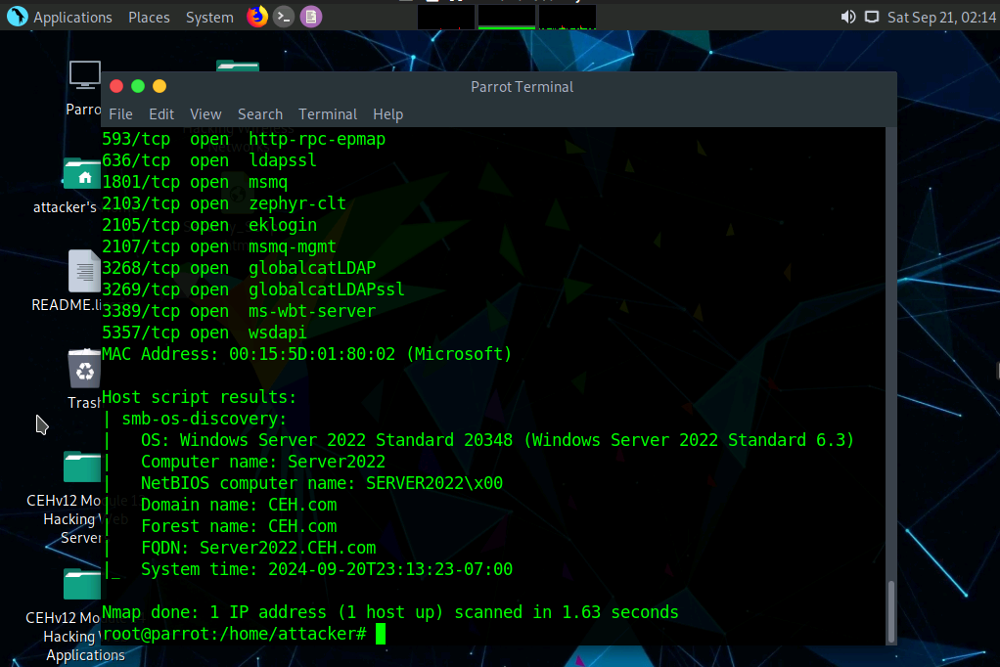

#  Network Reconnaissance & Attack Surface Audit 🟣

**Author:** CyberSal  
**Authorization:** ✅ Performed in an **EC-Council iLabs sandbox** and explicitly authorized for educational/assessment use.

---

## 🛡️ Scenario & Objectives: Audit Preparation

### Scenario
We are conducting an audit of the public-facing attack surface of a key asset (`10.10.1.22`). This phase identifies all exposed services to inform firewall policy reviews, log management requirements, and threat modeling for the next, deeper phase (**Enumeration**).

### Objectives
* Map the full TCP/UDP attack surface (live systems and open ports).
* Identify running services and operating system details.
* Define the highest-priority security zones and monitoring requirements based on exposed services.

### 🧰 Tools Used
* **Nmap** (CLI) and **Zenmap** (GUI)
* Parrot Linux attacker VM

---

## 📊 Method & Results: Attack Surface Mapping

*This section provides the evidence for the exposed service baseline.*

### 1) Full Port Scan & OS Fingerprint
**SYN scan (-sS)** `nmap -sS -v 10.10.1.22`  

**OS fingerprint** `nmap -O -v 10.10.1.22`  

---

## 📑 Report: Initial Defense Assessment

### Executive Summary
Initial reconnaissance against `10.10.1.22` confirmed the target is a Windows Server running core **Active Directory (AD)** services, exposing a high-value attack surface. The presence of **Kerberos (88)**, **LDAP (389/636)**, and **SMB (445)** indicates that the host's security posture is critical to the domain's integrity. Exposed **RDP (3389)** and **MSMQ (1801)** ports add high-risk vectors requiring immediate ACL verification.

### Exposed Services & Risk-Oriented Notes
This table outlines the observed service attack surface and the corresponding defensive focus required for each port:

| Port | Service (common name) | Defensive Focus / Potential Threat |
|-----:|------------------------|-----------------------------------|
| 53/tcp | domain (DNS) | **Zone Transfer:** Must verify that zone transfers are restricted to trusted secondary servers only. |
| 88/tcp | kerberos-sec | **Identity Attacks:** Must ensure logging is enabled to detect password spraying and Kerberoasting attempts. |
| 389/tcp | ldap | **Identity Enumeration:** Must prevent anonymous binds and enforce LDAP signing to protect directory data. |
| 445/tcp | microsoft-ds (SMB) | **Authentication/File Access:** Must enforce SMB signing and audit firewall rules to ensure this port is strictly limited to authorized hosts. |
| 3389/tcp | ms-wbt-server (RDP) | **Interactive Access:** Must ensure **Network Level Authentication (NLA)** is enforced and the port is firewalled aggressively. |
| **All AD Ports** | 88, 135, 389, 445, 464, 636, 3268, 3269 | **Domain Integrity:** Collective exposure requires a high-priority, dedicated firewall review. |

---

## 🚀 Next Steps: Purple Team Preparation for Enumeration

The reconnaissance phase has mapped the attack surface; the next steps focus on hardening defenses and preparing detection systems *before* the attacker moves to deep enumeration (Project 02).

### 1. Hardening & Firewall Policy Review (Blue Team Focus)
* **Perimeter Filtering:** Immediately audit the firewall to ensure ports for high-risk, unencrypted services like **RDP (3389)** and **SMB (445)** are not exposed to the public internet and are highly restricted internally via Access Control Lists (ACLs).
* **NLA Enforcement:** Verify that **Network Level Authentication (NLA)** is required for all Remote Desktop Protocol (RDP) sessions to mitigate denial-of-service and older exploit attempts.
* **Principle of Least Privilege:** Review Group Policy Objects (GPOs) to ensure unnecessary services (like NetBIOS over TCP/IP on 139) are disabled if possible.

### 2. Detection Baseline Establishment (Blue Team Focus)
* **Logging:** Prior to the deep enumeration phase, verify that detailed logging is enabled for all identified AD services (Kerberos, LDAP, SMB) to ensure audit logs capture the precise techniques used in the next phase (e.g., anonymous binds, failed authentication).
* **Threat Modeling:** Create a threat profile based on the exposed ports, specifically anticipating the use of tools like `enum4linux`, `snmp-check`, and `ldap-brute`, to set a baseline for acceptable traffic volume.

### 3. Attack Simulation Preparation (Red Team Focus)
* The next phase will involve utilizing protocols like SNMP and LDAP. We will specifically test for the existence of **default community strings** and **anonymous bind permissions**, as these are the most common vulnerabilities following service discovery.
