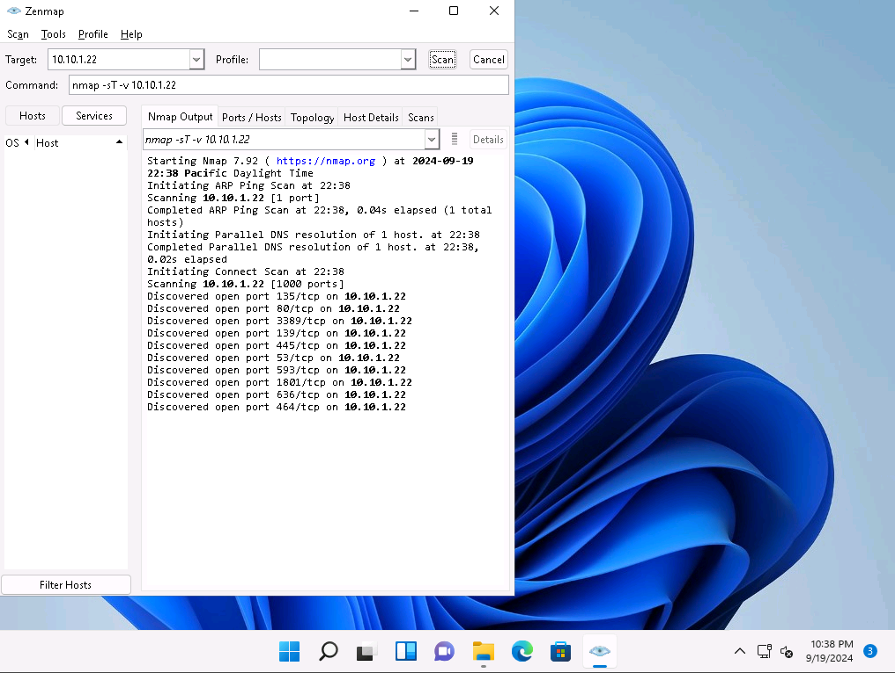

#  Network Reconnaissance

**Author:** CyberSal  
**Authorization:** ✅ Performed in an **EC-Council iLabs** sandbox and explicitly authorized for educational/assessment use.

## Scenario 🛡️
You are an ethical hacker working with a large organization (EC-Council). After completing OSINT, you move into **active reconnaissance** against a designated lab target to identify reachable services and potential entry points for later testing.

## Objectives 🎯
- Check for live systems and open ports  
- Identify active services on those systems  
- Perform light banner/OS fingerprinting  
- Note potential vulnerabilities / next steps

## Tools Used 🧰
- **Nmap** (CLI) and **Zenmap** (GUI)
- Parrot Linux attacker VM
- Screenshot capture for evidence

---

## Lab Environment (summary) 🧪
- Attacker host: Parrot Linux + Zenmap GUI  
- Target: `10.10.1.22` (Windows Server with AD roles and common services)

---

## Method & Results 📊

### 1) SYN (Half-Open) Scan — Fast service discovery
**SYN scan (-sS)**  
`nmap -sS -v 10.10.1.22`  


**TCP connect scan (-sT)**  
`nmap -sT -v 10.10.1.22`  


**Topology** (Zenmap → Topology)  


**OS fingerprint**  
`nmap -O -v 10.10.1.22`  


---

## Quick Notes 📝
- Multiple services typical of a Windows AD host were detected (e.g., Kerberos, LDAP, SMB).  
- Findings will guide targeted enumeration in the next lab (SMB shares, LDAP objects, SNMP, etc.).  

---

---

## Report 📑

### Executive Summary
Active reconnaissance of `10.10.1.22` identified a Windows Server running typical **Active Directory** services (Kerberos, LDAP/LDAPS, SMB), plus **RDP**, **DNS**, and **MSMQ**. These services collectively suggest a domain controller (or a member server with AD roles) and present multiple enumeration paths for identity and access reviews.

### Scope & Approach
- Host scanned: `10.10.1.22`
- Techniques: Nmap **SYN** scan (`-sS`), **TCP connect** scan (`-sT`), OS fingerprinting (`-O`), and **Zenmap Topology** view
- Evidence captured as screenshots and linked inline

---

## Findings 🔎

### Open Services (Observed)
| Port | Service (common name) | Likely Role / Notes |
|-----:|------------------------|---------------------|
| 53/tcp  | domain (DNS)              | AD-integrated DNS (name resolution, zone data) |
| 80/tcp  | http                      | Web / management endpoint (check for server headers & apps) |
| 88/tcp  | kerberos-sec              | AD Kerberos (ticketing/authN) |
| 135/tcp | msrpc                     | RPC endpoint mapping (used by many Windows mgmt ops) |
| 139/tcp | netbios-ssn               | Legacy SMB over NetBIOS (share discovery, name svc) |
| 389/tcp | ldap                      | AD LDAP (directory queries) |
| 445/tcp | microsoft-ds (SMB)        | SMB/CIFS file & named pipe access |
| 464/tcp | kpasswd5                  | Kerberos password service |
| 593/tcp | http-rpc-epmap            | RPC over HTTP |
| 636/tcp | ldaps                     | LDAP over TLS (secure directory queries) |
| 3268/tcp| globalcatLDAP             | Global Catalog (forest-wide searches) |
| 3269/tcp| globalcatLDAPssl          | Global Catalog over TLS |
| 3389/tcp| ms-wbt-server (RDP)       | Remote Desktop |
| 1801/tcp| msmq                      | Microsoft Message Queuing |
| 2103/2105/2107 | zephyr/msmq-mgmt   | MSMQ mgmt & messaging endpoints |

> **Evidence:**  
> - **SYN scan:** `./Screenshots/01_Nmap_sS_scan.png`  
> - **TCP connect scan:** `./Screenshots/01_Nmap_sT_scan.png`  
> - **OS fingerprint:** `./Screenshots/01_Nmap_OS_Fingerprint.png`  
> - **Topology:** `./Screenshots/01_Zenmap_Topology.png`

### Risk-Oriented Notes
- **AD core services (Kerberos/LDAP/SMB/GC):** enable rich **identity enumeration** (users, groups, SPNs). Weak policy or legacy protocols can lead to credential abuse or relay paths.  
- **RDP (3389):** direct interactive access path; review NLA/MFA, lockouts, and allowed groups.  
- **SMB (139/445):** potential for **share enumeration**, sensitive file discovery, or legacy signing settings.  
- **LDAP/LDAPS (389/636/3268/3269):** directory data exposure if anonymous or low-priv binds disclose too much.  
- **DNS (53):** zone transfers or misconfig may disclose internal structure.  
- **MSMQ (1801/210x):** often overlooked; occasionally useful for lateral movement or info disclosure.

---

## Next Steps 🚀

> Below are **targeted, read-only** enumeration actions to plan for the next lab. Use a low-priv domain user if available; otherwise test anonymous/NULL where appropriate in the authorized lab.

### 1) SMB & Shares
```bash
# Host discovery (already done via Nmap), then enumerate shares:
smbclient -L //10.10.1.22 -N              # try anonymous
smbclient //10.10.1.22/SHARENAME -N       # test read-only access
crackmapexec smb 10.10.1.22 --shares
