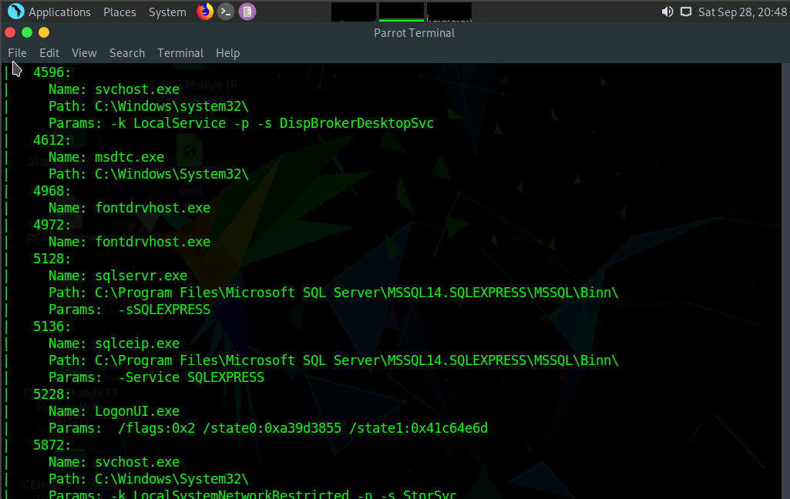
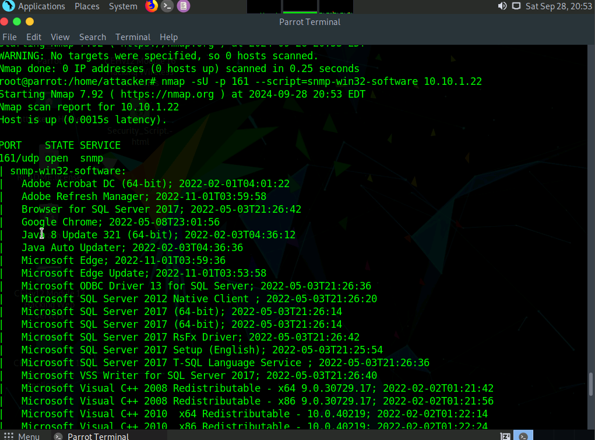
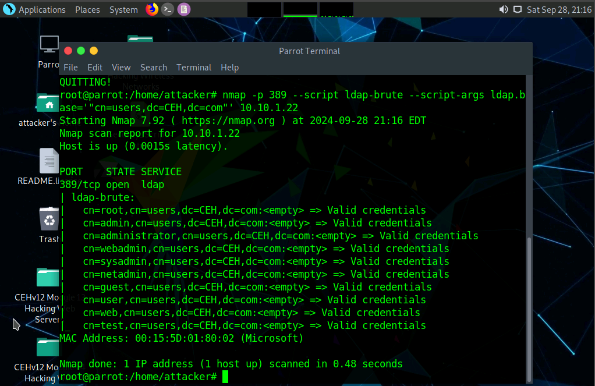
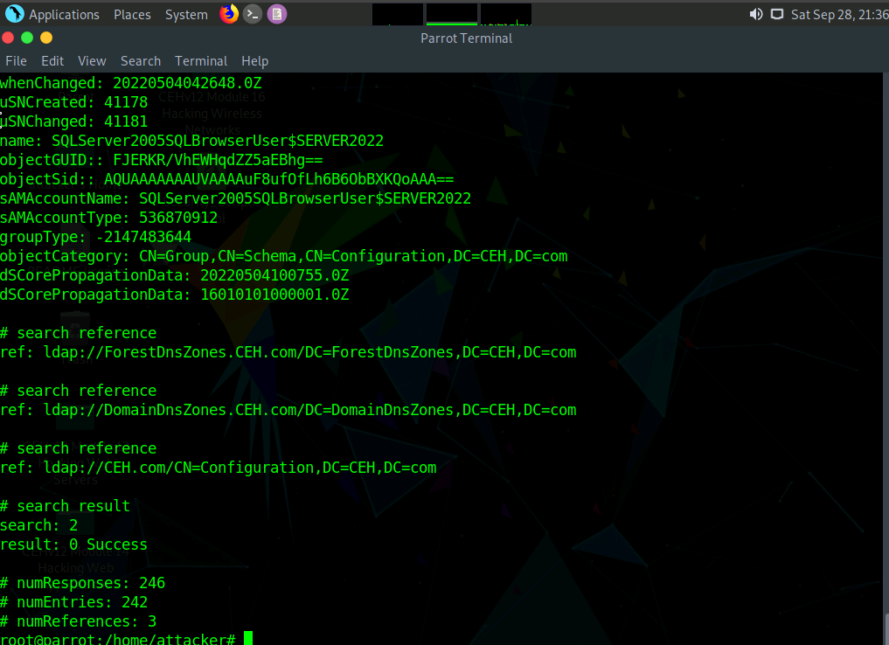
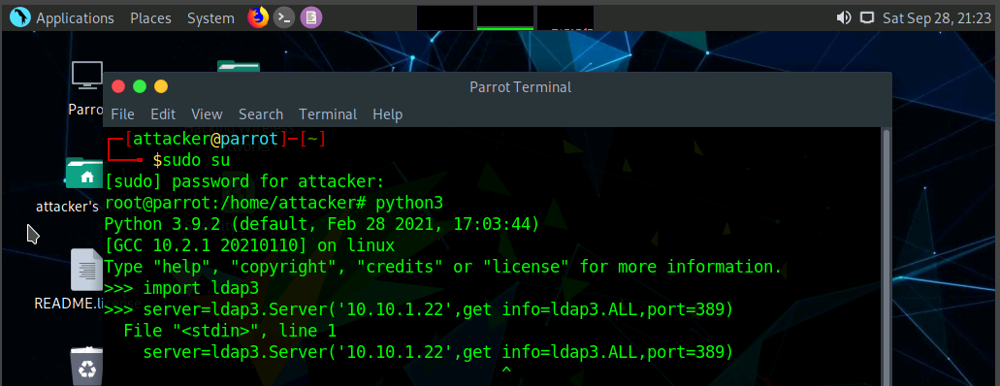
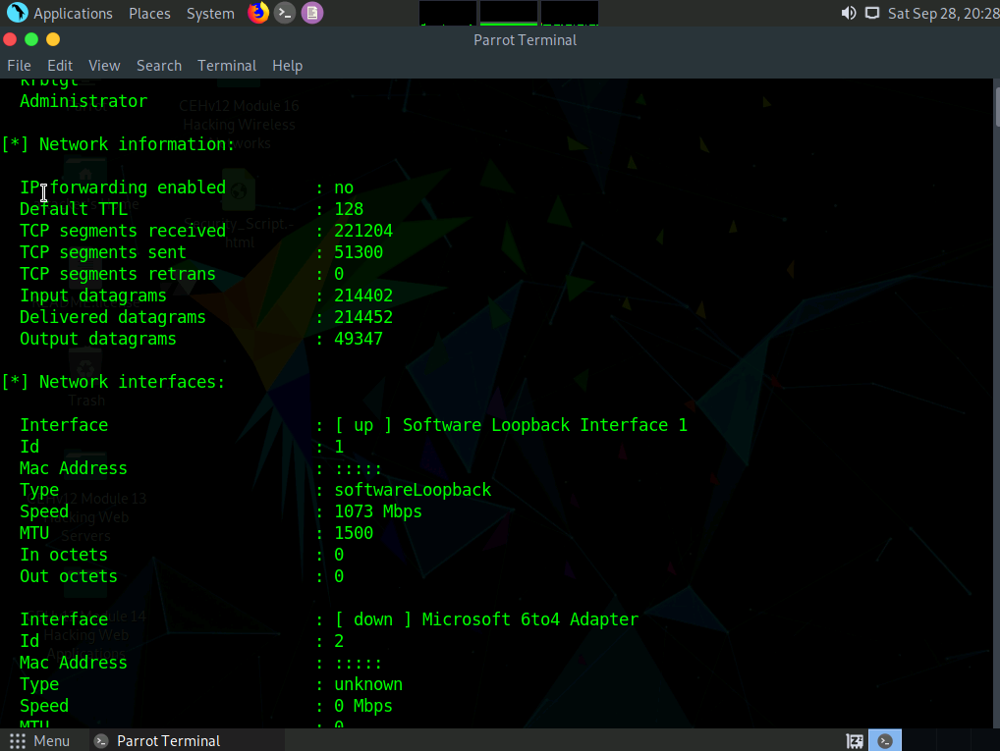

Enumeration & Service Discovery

**Author:** CyberSal  
**Authorization:** ✅ Performed in an **EC-Council iLabs** sandbox (authorized for educational/assessment use).

## Scenario 🛡️
Following reconnaissance, I performed **active enumeration** to extract identities, software, and service details over NetBIOS/SMB, SNMP, LDAP, and DNS. The aim is to map safe, viable paths for identity- and service-centric testing in later labs.

## Objectives 🎯
- Enumerate NetBIOS/SMB names and sessions  
- Pull host / software detail via SNMP  
- Query LDAP/AD to validate directory exposure  
- Verify DNS records and authority information

## Tools Used 🧰
- Windows built-ins: `nbtstat`, `nslookup`  
- **Nmap** + NSE scripts (`ldap-brute`, `snmp-*`)  
- **AD Explorer** (Sysinternals)  
- **SoftPerfect Network Scanner** (SNMP columns)

---

## Lab Environment 🧪
- Operator: Parrot Linux + Windows admin box  
- Primary target: `10.10.1.22` (Windows Server in lab domain)

---

## Method & Results 📊

### 1) NetBIOS / SMB overview (host identity)

---

 **Steps Performed**
1. Executed `enum4linux -a` to enumerate SMB shares, users, and server details.  
2. Queried SNMP for system and interface information using `snmpwalk`.  
3. Performed LDAP queries to collect directory structure and user objects.  
4. Compiled raw outputs into `/Results/` and captured screenshots in `/Screenshots/`.

---
## Methods & Results


### NetBIOS / SMB host identity
`nbtstat -A 10.10.1.22`  
[](./Screenshots/nbtstat_netbios.png)

### Confirmed exposure via unauthenticated community string (Public).
`nmap -sU -p 161 --script=snmp-sysdescr 10.10.1.22`  
[](./Screenshots/snmp_sysdesc.png)

`nmap -sU -p 161 --script=snmp-win32-software 10.10.1.22`  
[](./Screenshots/snmp_software.png)

### Confirmed exposure via anonymous bind, allowing directory browsing.
`nmap -p 389 --script=ldap-brute --script-args ldap.base='"cn=users,dc=CEH,dc=com"' 10.10.1.22`  
[](./Screenshots/ldap_brute.png)

_AD Explorer → connect to 10.10.1.22 → CN=Users_  
[](./Screenshots/ad_explorer_users.png)

### DNS authority / SOA timing
`nslookup` → `set q=SOA` → `certifiedhacker.com`  
_or_ `dig ns www.certifiedhacker.com`  
[](./Screenshots/dns_lookup.png)

### Network scan summary (multi-host view)
_SoftPerfect Network Scanner with SNMP columns enabled_  
[](./Screenshots/network_scan_summary.png)

----
## 📑 Report: Key Findings

### Executive Summary
Active enumeration against the primary target server (`10.10.1.22`) successfully identified critical configuration weaknesses in both **SNMP** and **LDAP**. These flaws allowed the extraction of sensitive data, including **full software inventory** and **valid Active Directory usernames**, which greatly increases the efficiency and precision of the next testing phases.

### Key Findings Table

| Protocol/Port | Tool Used | Key Finding | Risk/Impact |
| :---: | :--- | :--- | :--- |
| **SNMP** (161/udp) | `snmp-sysdescr`, `snmp-win32-software` | Default community string **`public`** successfully returned **full OS description and installed software inventory**. | **CRITICAL:** Complete system configuration and software versions are exposed, enabling highly targeted vulnerability research (CVE matching). |
| **LDAP/AD** (389) | `ldap-brute`, `AD Explorer` | **Anonymous bind** allowed successful extraction/browsing of **valid usernames** within the `CN=Users` container. | **HIGH:** Compromises identity security by providing a list of targets for credential-based attacks (e.g., password spraying, brute-force). |
| **NetBIOS/SMB** (139/445) | `nbtstat -A`, `enum4linux` | Confirmed NetBIOS name and domain membership. Enumerated **SMB shares** and **service accounts**. | Exposes internal network topology and potential file storage areas for subsequent credential auditing. |
| **DNS** (53) | `nslookup` (SOA) | Retrieved **Start of Authority (SOA) record** and timing details for the target domain (`certifiedhacker.com`). | Information leakage; confirms domain authority for potential zone transfer attempts or external targeting. |

---

## 🚀 Next Steps

Based on the critical identity and service information gathered (default SNMP community string, anonymous LDAP bind), the assessment will pivot from passive information gathering to targeted validation and exploitation.

1.  **Targeted Credential Auditing:**
    -   Attempt authentication against the discovered **SMB Shares** and **LDAP** using common default credentials or password spraying techniques against the harvested user list.
    ```bash
    # Example: Test access to discovered shares anonymously
    smbclient -L //10.10.1.22 -N 
    
    # Example: Password spraying against LDAP-enumerated users
    crackmapexec smb 10.10.1.22 -u <LDAP_User_List> -p <Common_Password>
    ```

2.  **Vulnerability Scanning:**
    -   Initiate a **targeted vulnerability scan** using the specific OS and software versions (retrieved via SNMP) to confirm the existence of known Common Vulnerabilities and Exposures (CVEs).

3.  **Lateral Movement Planning:**
    -   Utilize the validated accounts and discovered shares to plan out potential **lateral movement paths** across the network for a multi-stage attack simulation.

