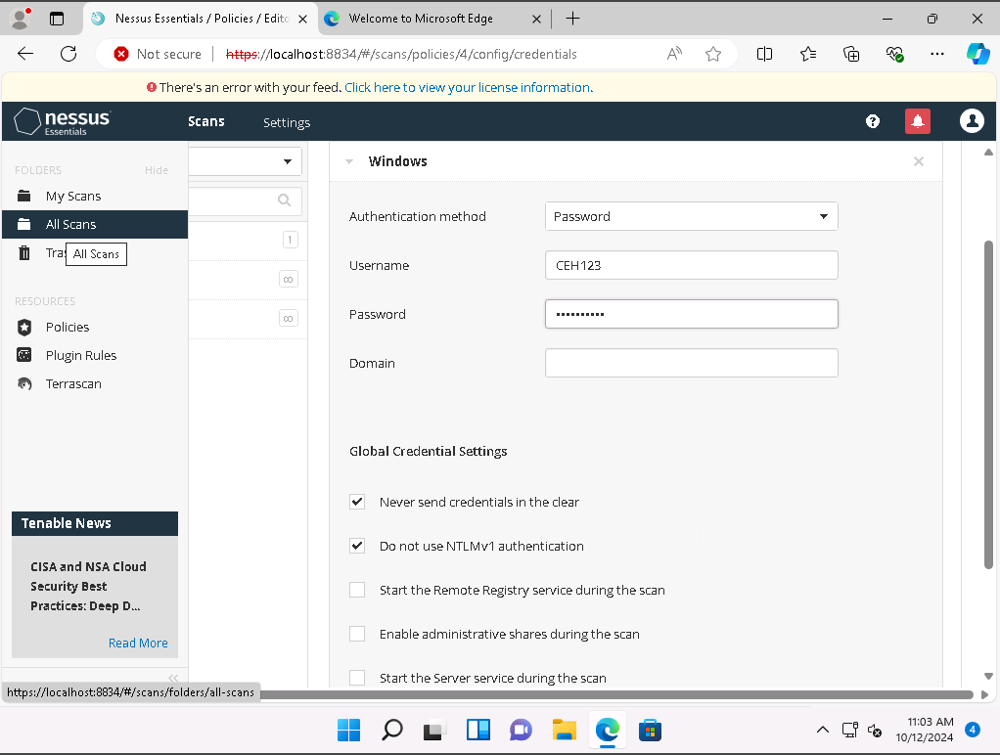
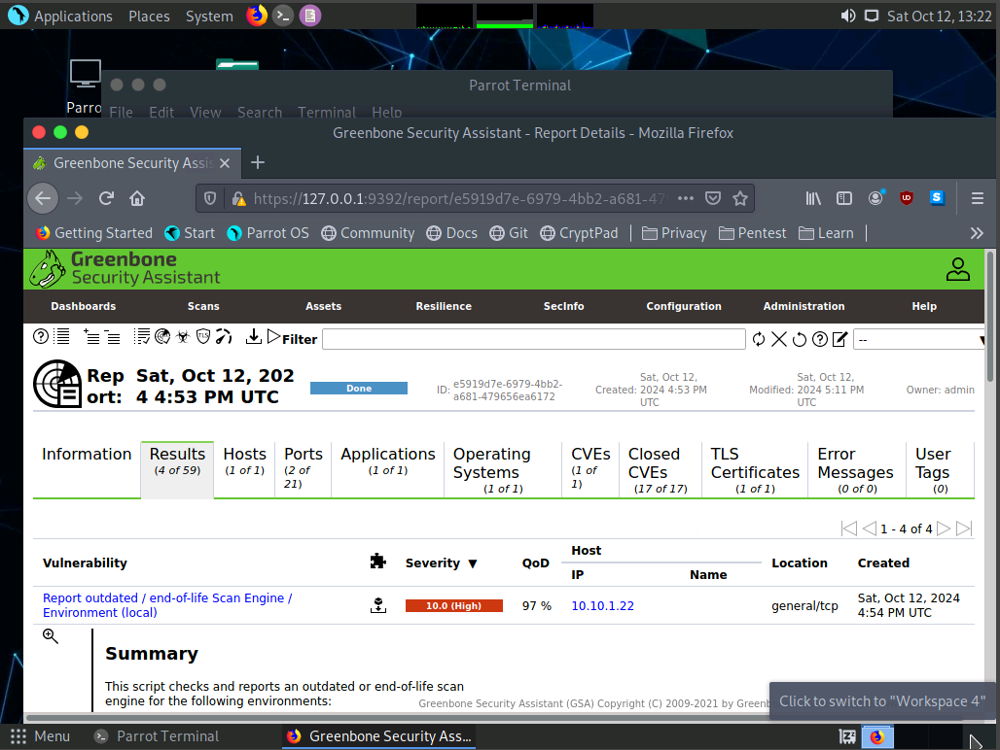
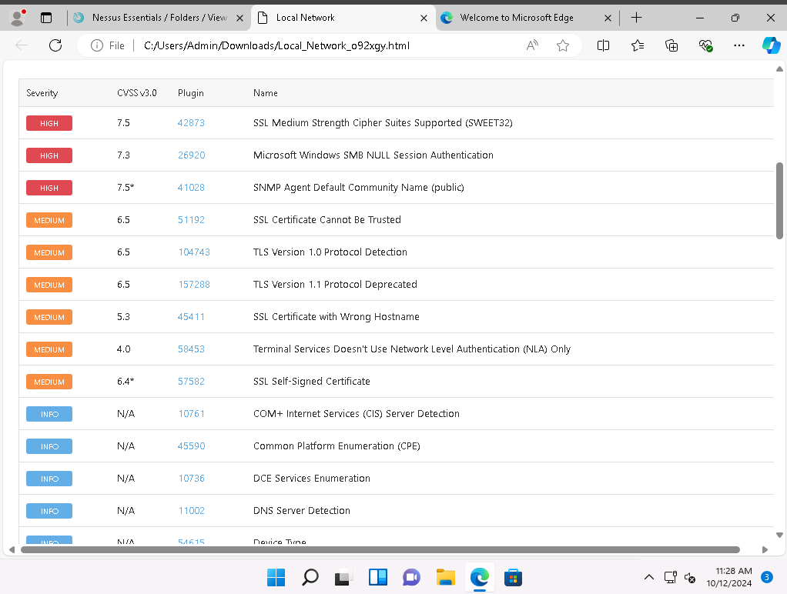
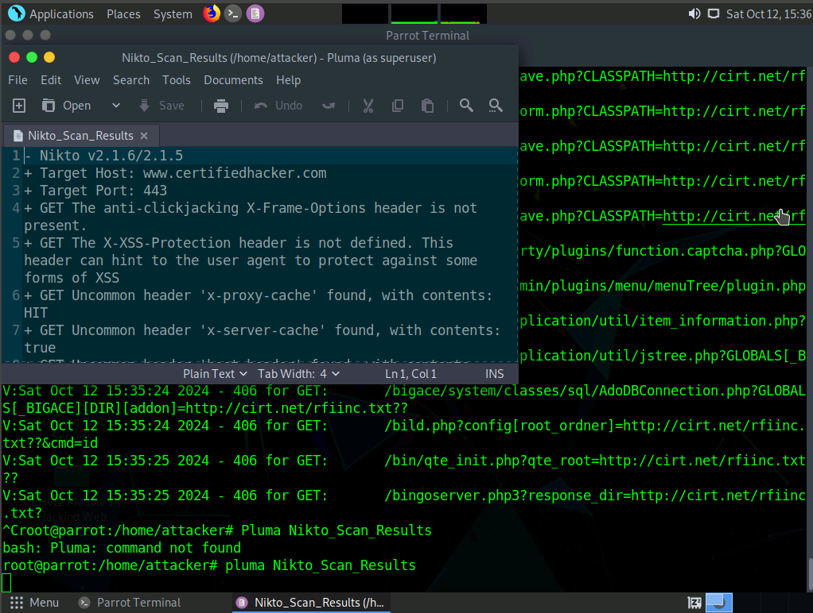

Vulnerability Assessment & Risk Prioritization Audit 🟣

**Author:** CyberSal  
**Authorization:** ✅ Performed in an **EC-Council iLabs** sandbox (authorized for educational/assessment use).

---

## 🛡️ Scenario & Objectives: Risk-Based Audit

### Scenario
Following the enumeration phase (Project 02), we leveraged the gathered information (OS, software, services) to conduct a targeted, **risk-based vulnerability assessment**. The goal was to move from a list of open ports to a **prioritized list of confirmed, actionable risks** for the patch and configuration management teams.

### Objectives
* **Map Risks:** Use public databases (CWE, CVE, NVD) to confirm the severity of vulnerabilities associated with discovered services.
* **Automate Assessment:** Utilize professional vulnerability scanners (Nessus, OpenVAS) to generate a full, objective risk report.
* **Prioritize Remediation:** Use **Common Vulnerability Scoring System (CVSS)** scores (from NVD) to prioritize patching and mitigation efforts.

### 🧰 Tools Used
* **Vulnerability Databases:** Common Weakness Enumeration (CWE), Common Vulnerabilities and Exposures (CVE), National Vulnerability Database (NVD).
* **Authenticated Scanners:** Nessus, OpenVAS.
* **Web Scanner:** Nikto (CGI Scanner).

---

## 📊 Method & Results: Full Attack Surface Scan

*This section documents the structured process used to generate a comprehensive, prioritized list of confirmed vulnerabilities, backed by technical evidence.*

### 1. Manual Vulnerability Research (Risk Mapping)

Manual research established a risk baseline by confirming the severity of flaws using standardized scoring systems. The **Graphical Score Representation** was used to calculate risk severity and exploitability.

### 2. Automated Authenticated Scanning (Risk Prioritization)

**Authenticated scanning** was performed using valid Windows credentials to gain a high-fidelity view of the system's patching status and configuration health, reducing false positives.

| Tool | Proof of Successful Scan (Embedded Image) | Summary of Result |
| :--- | :--- | :--- |
| **Nessus** |  | Confirmed capability to perform high-accuracy, authenticated auditing. |
| **OpenVAS** |  | Identified a **Critical 10.0** finding (Outdated Scan Engine) and **Medium** findings. |
| **Nessus** |  | Provided a comprehensive list of **High** and **Medium** findings, including SNMP and deprecated TLS. |
| **Nikto** |  | Identified server headers and default files on the web application attack surface. |

---

## 📑 Report: Actionable Findings and Prioritization

### Executive Summary
The combined assessment successfully identified several **Critical and High-severity vulnerabilities**. The findings confirm weaknesses related to weak passwords/permissions (default SNMP), and application configuration errors (Deprecated TLS). Remediation must be immediately prioritized based on the CVSS scores to reduce the most exploitable part of the attack surface.

### Prioritized Vulnerability Findings (Synthesis of OpenVAS/Nessus)
*This table synthesizes the most severe findings from both automated tools, prioritized by their assigned CVSS severity.*

| Severity | CVSS Score (Nessus/OpenVAS) | Vulnerability Description | Remediation Type |
| :--- | :--- | :--- | :--- |
| **CRITICAL** | 10.0 | **Report outdated/end-of-life Scan Engine/Environment** | **Patching** (Immediate Infrastructure Fix) |
| **HIGH** | 7.5 | **SNMP Agent Default Community Name** (`public`) | **Configuration Hardening** (Fix Misconfiguration) |
| **HIGH** | 7.3 | **Microsoft Windows SMB NULL Session Authentication** | **Configuration Hardening** (Authentication Policy) |
| **MEDIUM** | 6.5 | **SSL/TLS Deprecated Protocols** (TLS 1.0/1.1 detected) | **Configuration Hardening** (Secure Protocol Enforcement) |
| **MEDIUM** | 4.0 | Terminal Services Doesn't Use **Network Level Authentication (NLA)** Only | **Policy Review** (Access Control) |

---

## 🚀 Next Steps: Vulnerability Life-Cycle Management (Purple Team Focus)

### 1. Remediation & Configuration Management (Blue Team Focus)
* **Critical Patching:** Immediately deploy patches for all Critical and High-risk vulnerabilities identified by the scanners. This must include updating the scan engine.
* **Protocol Hardening:** Enforce the disabling of deprecated TLS protocols (1.0/1.1) and implement strong, non-default credentials for the SNMP agent.
* **Security GPO:** Verify Group Policy Objects (GPOs) enforce **Network Level Authentication (NLA)** for RDP and prohibit SMB NULL Session Authentication.

### 2. Continuous Monitoring & Validation (Purple Team Focus)
* **Continuous Scanning:** Schedule authenticated scans (Nessus/OpenVAS) to run weekly to monitor the environment for new vulnerabilities and patch regression.
* **Re-Validation:** After patch deployment is confirmed, the security team must **re-run the scanners** against the target to confirm all Critical and High-risk findings have moved to a **Fixed** status.
