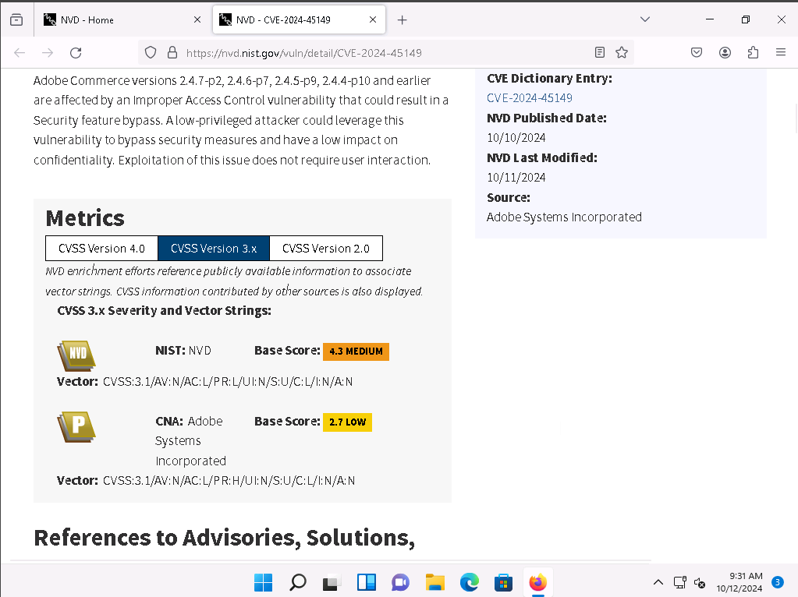

# 03 — Vulnerability Assessment & Risk Prioritization Audit 🟣

**Author:** CyberSal  
**Authorization:** ✅ Performed in an **EC-Council iLabs** sandbox (authorized for educational/assessment use).

---

## 🛡️ Scenario & Objectives: Risk-Based Audit

### Scenario
[cite_start]Following the enumeration phase (Project 02), we leveraged the gathered information (OS, software, services) to conduct a targeted, **risk-based vulnerability assessment**[cite: 3]. The goal was to move from a list of open ports to a **prioritized list of confirmed, actionable risks** for the patch and configuration management teams.

### Objectives
* [cite_start]**Map Risks:** Use public databases (CWE, CVE, NVD) to confirm the severity of vulnerabilities associated with discovered services[cite: 6, 7].
* **Automate Assessment:** Utilize professional vulnerability scanners (Nessus, OpenVAS) to generate a full, objective risk report.
* [cite_start]**Prioritize Remediation:** Use **Common Vulnerability Scoring System (CVSS)** scores (from NVD) to prioritize patching and mitigation efforts[cite: 22, 23, 24].

### 🧰 Tools Used
* [cite_start]**Vulnerability Databases:** Common Weakness Enumeration (CWE), Common Vulnerabilities and Exposures (CVE), National Vulnerability Database (NVD)[cite: 14, 18, 22].
* [cite_start]**Authenticated Scanners:** Nessus, OpenVAS[cite: 27, 33].
* [cite_start]**Web Scanner:** Nikto (CGI Scanner)[cite: 42].

---

## 📊 Method & Results: Full Attack Surface Scan

*This section documents the structured process used to generate a comprehensive, prioritized list of confirmed vulnerabilities.*

### 1. Manual Vulnerability Research (Risk Mapping)

Manual research established a risk baseline by confirming the severity of flaws using standardized scoring systems. [cite_start]The **Graphical Score Representation** was used to calculate risk severity and exploitability[cite: 24].

### 2. Automated Authenticated Scanning (Risk Prioritization)

[cite_start]**Authenticated scanning** was performed using valid Windows credentials to gain a high-fidelity view of the system's patching status and configuration health, reducing false positives[cite: 38].

| Tool | Evidence Captured | Summary of Result |
| :--- | :--- | :--- |
| **Nessus** | [cite_start]Credentials Specification [cite: 38] | [cite_start]Confirmed capability to perform high-accuracy, authenticated auditing[cite: 38]. |
| **OpenVAS** | [cite_start]Scan Completed [cite: 29] | [cite_start]Identified a **Critical 10.0** finding (Outdated Scan Engine) [cite: 30] [cite_start]and **Medium** findings (e.g., Deprecated TLS Protocols)[cite: 32]. |
| **Nessus** | [cite_start]List of Discovered Vulnerabilities [cite: 41] | [cite_start]Provided a comprehensive list of **High** and **Medium** findings, including **SNMP Agent Default Community Name** (7.5) and **Deprecated TLS Protocols** (6.5)[cite: 41]. |
| **Nikto** | [cite_start]CGI/Web Scan Results [cite: 43] | [cite_start]Identified server headers and default files on the web application attack surface[cite: 43]. |

---

## 📑 Report: Actionable Findings and Prioritization

### Executive Summary
[cite_start]The combined assessment successfully identified several **Critical and High-severity vulnerabilities**[cite: 40]. [cite_start]The findings confirm weaknesses related to weak passwords/permissions (default SNMP) [cite: 41][cite_start], and application configuration errors (Deprecated TLS)[cite: 32, 41]. Remediation must be immediately prioritized based on the CVSS scores to reduce the most exploitable part of the attack surface.

### Prioritized Vulnerability Findings (Synthesis of OpenVAS/Nessus)
*This table synthesizes the most severe findings from both automated tools, prioritized by their assigned CVSS severity.*

| Severity | CVSS Score (Nessus/OpenVAS) | Vulnerability Description | Remediation Type |
| :--- | :--- | :--- | :--- |
| **CRITICAL** | 10.0 | [cite_start]**Report outdated/end-of-life Scan Engine/Environment** [cite: 30] | **Patching** (Immediate Infrastructure Fix) |
| **HIGH** | 7.5 | [cite_start]**SNMP Agent Default Community Name** (`public`) [cite: 41] | **Configuration Hardening** (Fix Misconfiguration) |
| **HIGH** | 7.3 | [cite_start]**Microsoft Windows SMB NULL Session Authentication** [cite: 41] | **Configuration Hardening** (Authentication Policy) |
| **MEDIUM** | 6.5 | [cite_start]**SSL/TLS Deprecated Protocols** (TLS 1.0/1.1 detected) [cite: 41] | **Configuration Hardening** (Secure Protocol Enforcement) |
| **MEDIUM** | 4.0 | [cite_start]Terminal Services Doesn't Use **Network Level Authentication (NLA)** Only [cite: 41] | **Policy Review** (Access Control) |

---

## 🚀 Next Steps: Vulnerability Life-Cycle Management (Purple Team Focus)

### 1. Remediation & Configuration Management (Blue Team Focus)
* **Critical Patching:** Immediately deploy patches for all Critical and High-risk vulnerabilities identified by the scanners. [cite_start]This must include updating the scan engine[cite: 30].
* [cite_start]**Protocol Hardening:** Enforce the disabling of deprecated TLS protocols (1.0/1.1) and implement strong, non-default credentials for the SNMP agent[cite: 41].
* [cite_start]**Security GPO:** Verify Group Policy Objects (GPOs) enforce **Network Level Authentication (NLA)** for RDP and prohibit SMB NULL Session Authentication[cite: 41].

### 2. Continuous Monitoring & Validation (Purple Team Focus)
* **Continuous Scanning:** Schedule authenticated scans (Nessus/OpenVAS) to run weekly to monitor the environment for new vulnerabilities and patch regression.
* **Re-Validation:** After patch deployment is confirmed, the security team must **re-run the scanners** against the target to confirm all Critical and High-risk findings have moved to a **Fixed** status.
