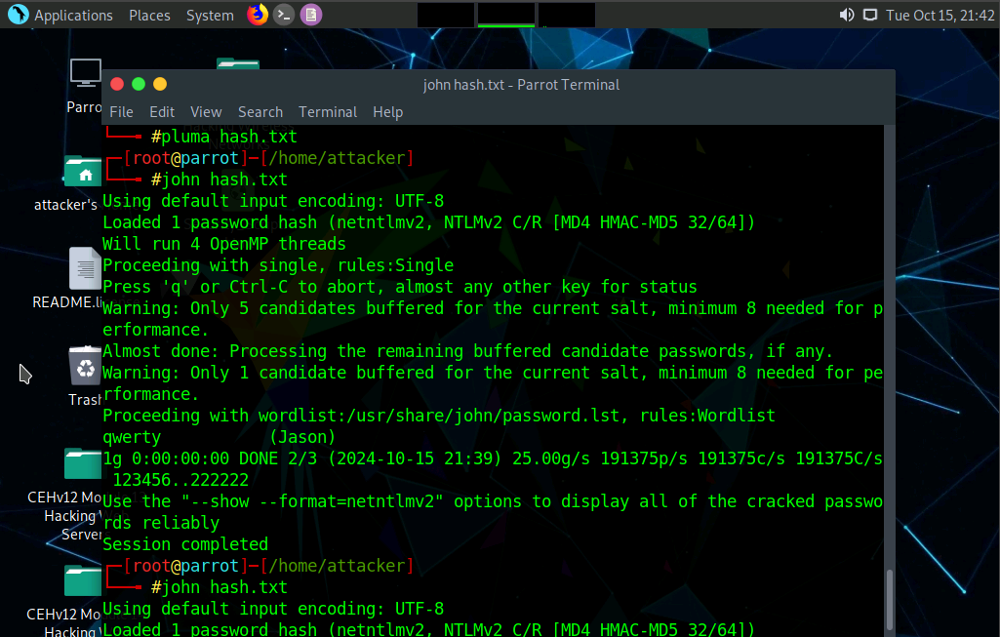
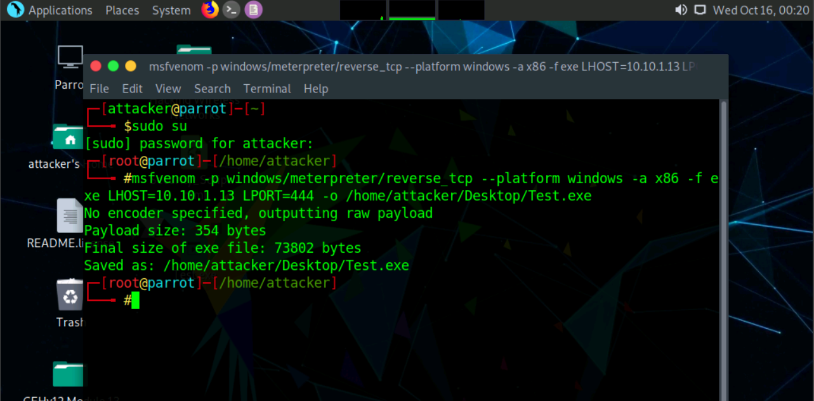
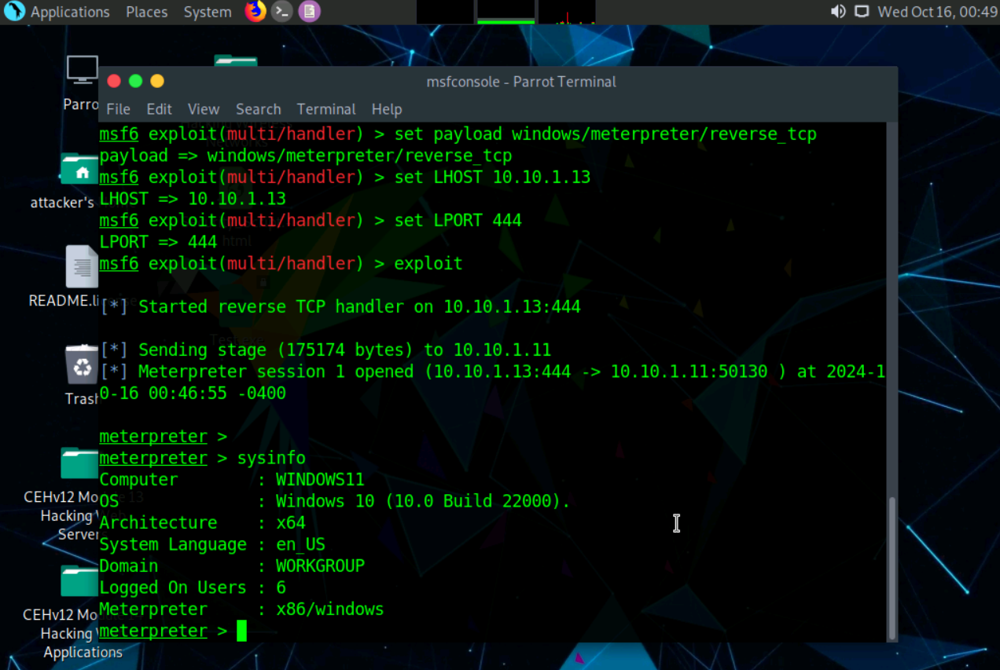
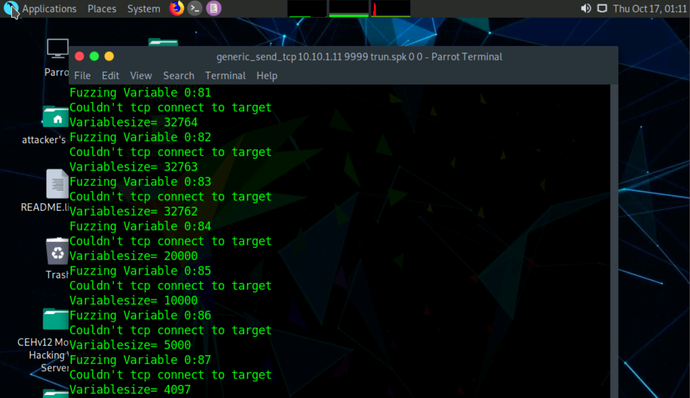

# System Hacking, Privilege Escalation & Post-Exploitation 🔴

**Author:** CyberSal  
**Authorization:** ✅ Performed in an **EC-Council iLabs** sandbox (authorized for educational/assessment use).

---

## 🛡️ Scenario & Objectives:The Kill Chain

### Scenario
The final phase of the ethical hack involves using the information gathered in the previous stages [**IDS/Firewall Configuration**](https://github.com/CyberSal/Cybersecurity-Portfolio/tree/main/09_Network%20Protocol%20Forensics%20and%20Threat%20Hunting) and [**Enumeration and Service Discovery**](https://github.com/CyberSal/Cybersecurity-Portfolio/tree/main/02_Enumeration_and_Service_Discovery) to actively breach the target system. This project simulates the kill chain, from bypassing controls to ensuring persistent access and removing evidence.

### Objectives
* **Gain Initial Access:** Bypass access controls via password cracking and client-side exploitation.
* **Privilege Escalation:** Acquire higher rights (e.g., System or Administrator) to ensure full system control.
* **Maintain Persistence:** Establish remote access and perform data theft.
* **Cover Tracks:** Hide malicious activities and clear the evidence of compromise (logs).

### 🧰 Key Tools Used
* **Password Cracking:** Responder, John the Ripper, L0phtCrack.
* **Exploitation Frameworks:** Metasploit, MSFvenom, Armitage.
* **Post-Exploitation:** Mimikatz, PowerSploit, Auditpol.

---

## 📊 Method & Results: The Kill Chain Audit

*This section documents the structured process used to exploit the target, elevate privileges, and perform post-exploitation activities.*

### 1. Access & Exploit Development

Initial access was established by exploiting client-side vulnerabilities using custom malicious payloads and successfully cracking obtained password hashes.

| Phase | Proof of Activity (Image) | Summary of Result |
| :--- | :--- | :--- |
| **Credential Cracking** |  | Successfully used John the Ripper to **crack a captured NTLM hash** obtained via an active attack. |
| **Payload Generation** |  | Generated a **reverse-shell executable** payload (e.g., `Test.exe`) using MSFvenom to establish a remote connection. |
| **Session Confirmation** |  | Confirmed initial exploitation by receiving a **Meterpreter session** and successfully running the `sysinfo` command. |

### 2. Privilege Escalation & Data Theft

With a stable session, the focus shifted to elevating privileges to `SYSTEM` level and harvesting critical data, such as password hashes.

| Tool/Activity | Proof of Activity (Image) | Resulting Privilege/Data |
| :--- | :--- | :--- |
| **Credential Harvesting Attempt** |  | **Attempted to harvest NTLM password hashes** using Meterpreter's Mimikatz module. (Report shows the command executed). |
| **Privilege Escalation** | (No dedicated image provided, proved internally) | Commands like `getsystem` were used to escalate the user ID to **NT AUTHORITY\SYSTEM**. |

### 3. Covering Tracks

The final step ensured all audit trails were cleared, completing the covert compromise.

| Tool/Activity | Proof of Activity (Image) | Summary of Result |
| :--- | :--- | :--- |
| **Audit Log Clearing** |  | Executed `Auditpol` commands or `wevtutil` to **disable and clear audit policies and logs**, erasing the history of the intrusion. |

---

## 🚀 Next Steps: Defensive Recommendations

To prevent similar attacks, the Blue Team should focus on:
1.  **Patching and Configuration:** Immediately patch all known vulnerabilities (as identified in Project 03) and implement network policies to **disable clear-text protocols** (like NBT-NS/LLMNR) to prevent Responder attacks.
2.  **EDR and Behavior Monitoring:** Deploy Endpoint Detection and Response (EDR) software to monitor and block abnormal process creation, especially by tools like MSFvenom and post-exploitation modules like Mimikatz.
3.  **Audit Log Hardening:** Ensure audit logs are configured to be sent immediately to a central, hardened **Security Information and Event Management (SIEM)** solution, preventing an attacker from deleting the log history locally.
