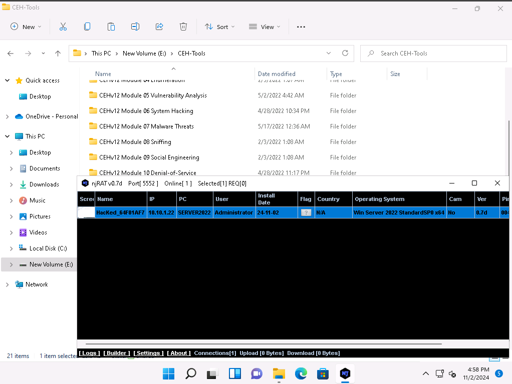
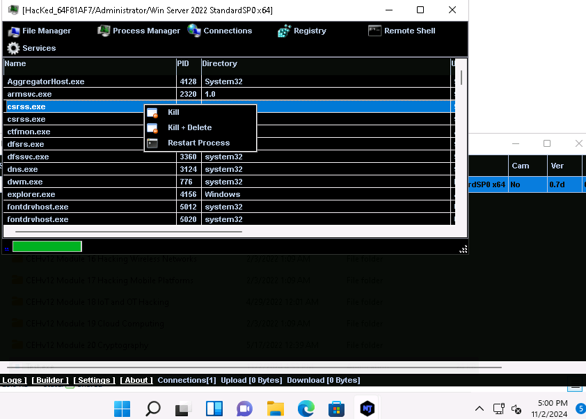
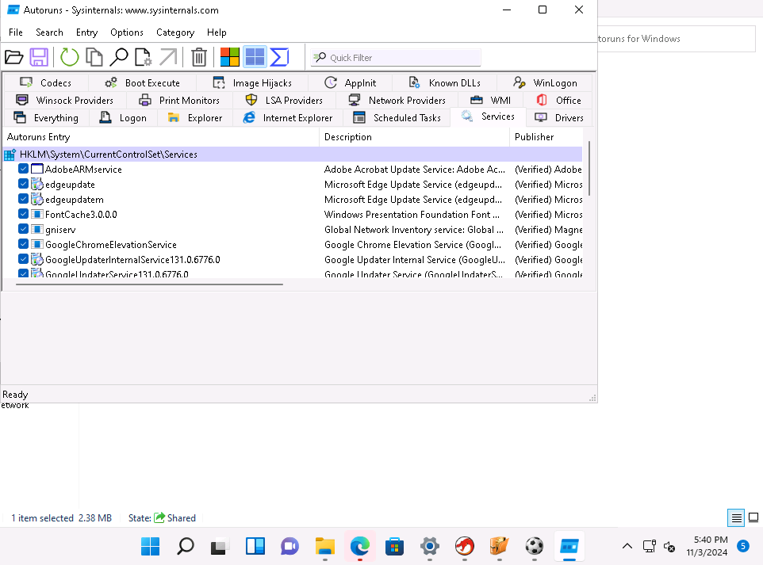
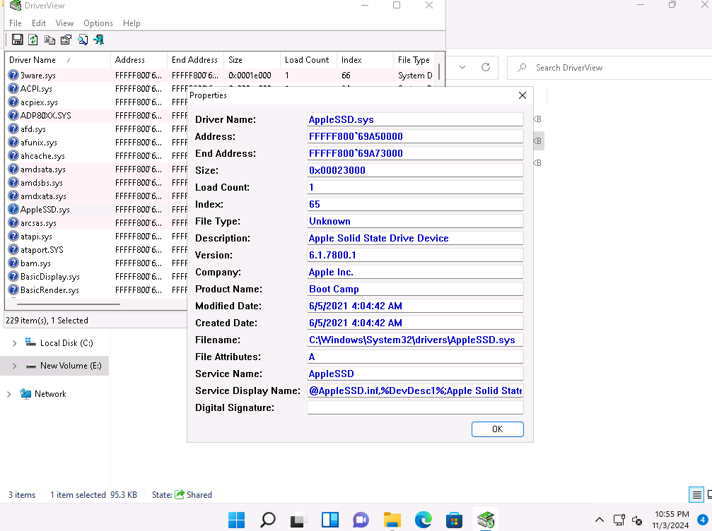
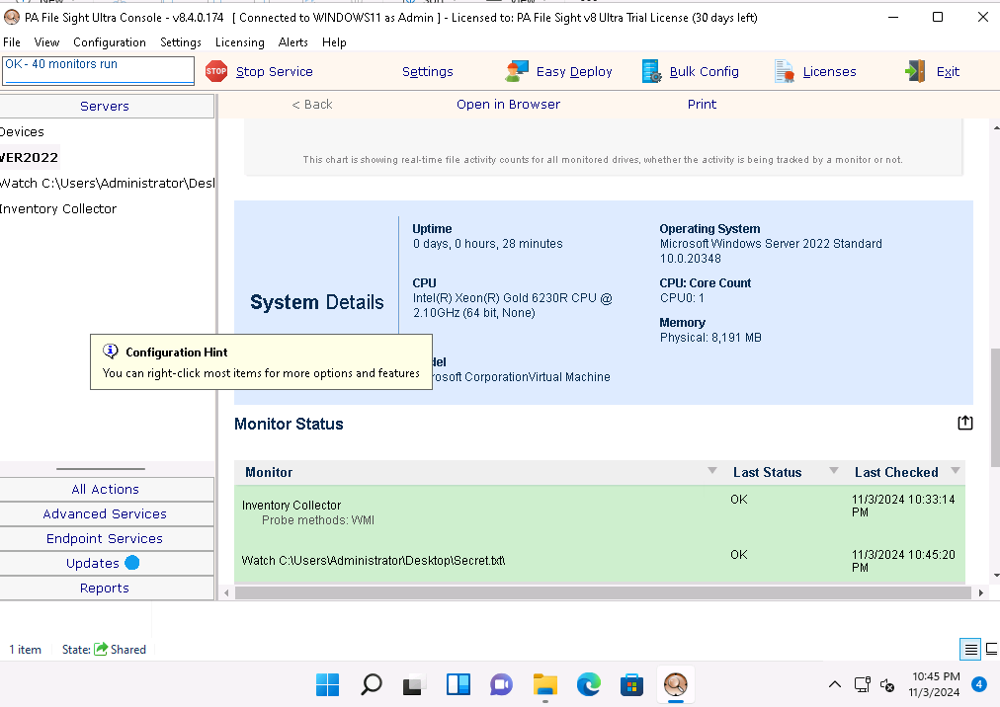

# 05 — Malware Analysis and Detection 🟡

**Author:** CyberSal  
**Authorization:** ✅ Performed in an **EC-Council iLabs** sandbox (authorized for educational/assessment use).

---

## 🛡️ Scenario & Objectives: Defense Against Malware

### Scenario
The goal of this project is to simulate and analyze the full life-cycle of a malware attack, from creation to execution and, most critically, to detection. This demonstrates defensive capabilities by using analytical tools to determine malware functionality and persistence mechanisms.

### Objectives
* **Creation & Exploitation:** Create a functional Remote Access Trojan (RAT) to gain control over a target machine.
* **Malware Analysis:** Perform dynamic and static analysis to understand the Trojan's functionality and persistence.
* **Detection:** Utilize system monitoring and analysis tools to detect malware components and malicious activity.
* **Defense Hardening:** Recommend security controls to prevent malware execution and persistence.

### 🧰 Key Tools Used
* **Malware Creation:** njRAT, Metasploit/MSFvenom.
* **System Analysis:** Autoruns, Process Explorer, DriverView.
* **Monitoring & Detection:** PA File Sight, WinPatrol.

---

## 📊 Method & Results: Full Analysis Cycle Audit

*This section documents the structured process used to create, execute, analyze, and detect advanced malware threats.*

### 1. Malware Creation and Initial Access

Initial access was established using the njRAT Trojan, confirming the ability of an attacker to bypass basic network defenses and establish persistent control.

| Phase | Proof of Activity (Image) | Summary of Result |
| :--- | :--- | :--- |
| **Session Established** |  | Confirmed successful remote control session using the njRAT client, granting **full system control** over the victim. |
| **Functionality Proof** |  | Demonstrated post-exploitation control by viewing and manipulating the **victim's process manager** via the malware C2 panel. |

### 2. Malware Analysis (Persistence & Rootkit Detection)

Analysis tools were used to inspect system processes and files to determine how the malware achieves persistence and to detect hidden components like rootkits.

| Tool/Activity | Proof of Activity (Image) | Analysis/Detection Focus |
| :--- | :--- | :--- |
| **Persistence Analysis** |  | Used Autoruns to inspect **startup services and auto-run programs**, a common persistence method used by Trojans. |
| **Rootkit Detection** |  | Used DriverView to inspect **device driver properties**, a technique for detecting hidden malicious drivers or kernel-level rootkits. |

### 3. Continuous Monitoring & Detection

Monitoring solutions were deployed and configured to watch for signs of file tampering and unauthorized activity on critical files.

| Tool/Activity | Proof of Activity (Image) | Detection Outcome |
| :--- | :--- | :--- |
| **File Monitoring** |  | Confirmed that PA File Sight successfully captured and **logged activity** on a monitored file (`Secret.txt`), proving the detection capability. |

---

## 🚀 Next Steps: Defensive Recommendations

To create an effective defense against sophisticated malware, the Blue Team should focus on:
1.  **Endpoint Security:** Implement **Application Whitelisting** to prevent unauthorized executables (like RATs and Trojans) from running, regardless of whether they are detected by traditional antivirus.
2.  **Code Analysis:** Use static and dynamic analysis tools (IDA Pro, Cuckoo Sandbox) to quarantine new or suspicious files and safely determine their full functionality and C2 infrastructure before they execute in a live environment.
3.  **HIPS Implementation:** Deploy a **Host Intrusion Prevention System (HIPS)** to specifically monitor and block unauthorized attempts to modify critical system areas, such as the registry run keys and service startup configuration.
4.  **Security Awareness:** Implement mandatory training on social engineering and phishing, as user execution (e.g., clicking on the Trojan) is the primary vector for initial access.
