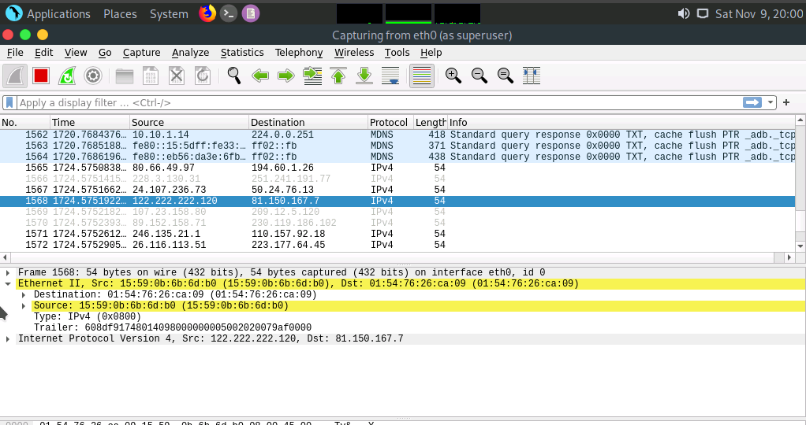
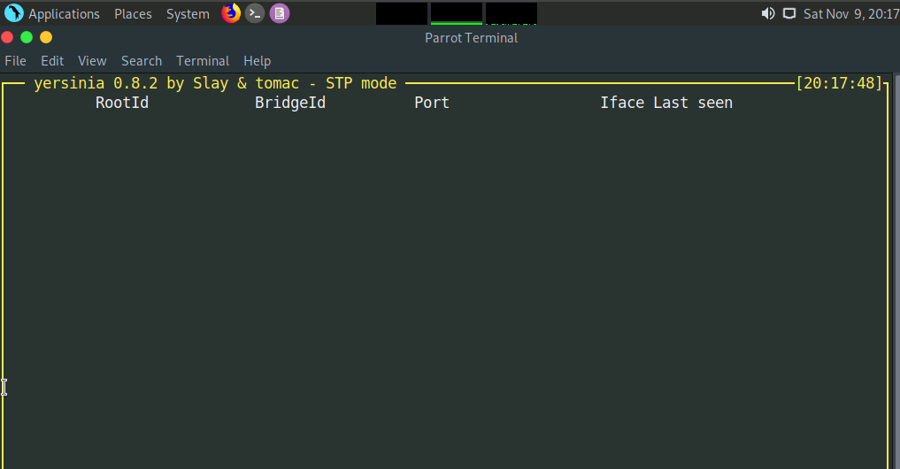
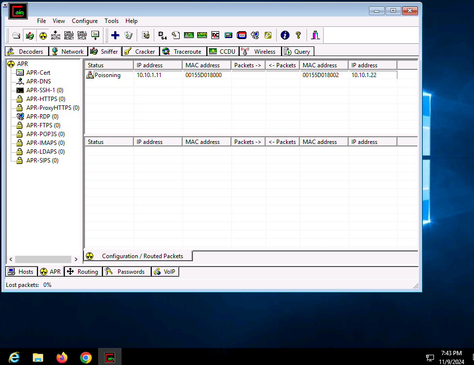
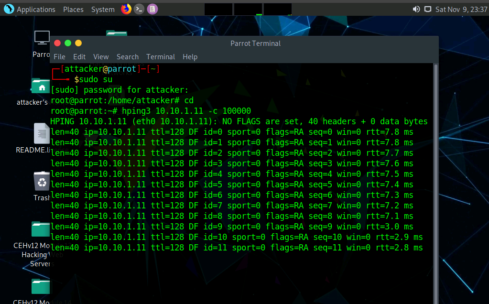

# Network Sniffing & Denial of Service (DoS) 🟦

**Author:** CyberSal  
**Authorization:** ✅ Performed in an **EC-Council iLabs** sandbox (authorized for educational/assessment use).

---

## 🛡️ Scenario & Objectives: Network Infrastructure Audit

### Scenario
This project focuses on the assessment of network infrastructure security by simulating active sniffing, session hijacking, and denial of service (DoS) attacks. The goal is to identify weaknesses in network protocols (like Ethernet, ARP, and DHCP) and demonstrate the impact of flooding attacks.

### Objectives
* **Sniffing:** Perform active and passive network sniffing to capture and analyze traffic.
* **ARP Poisoning:** Execute Man-in-the-Middle (MITM) attacks using ARP Poisoning.
* **DoS Attacks:** Demonstrate service disruption through MAC flooding and packet flooding (hping3).
* **Detection:** Utilize network analysis tools (Wireshark) to detect the simulated attacks.

### 🧰 Key Tools Used
* **Sniffing/Analysis:** Wireshark, Zenmap, Capsa Network Analyzer.
* **Network Manipulation:** macof, Yersinia, Cain & Abel.
* **Denial of Service:** hping3.

---

## 📊 Method & Results: Infrastructure Attack Surface Audit

*This section documents the structured process used to exploit weaknesses in fundamental network protocols and perform DoS attacks.*

### 1. Sniffing and Man-in-the-Middle (MITM) Attacks

We exploited inherent weaknesses in Layer 2 protocols (MAC/ARP) to manipulate traffic flow and capture data.

| Attack Type | Proof of Activity (Image) | Summary of Result |
| :--- | :--- | :--- |
| **Active Sniffing** |  | Confirmed Wireshark was running in promiscuous mode and successfully **captured flooded MAC/DHCP traffic** on the interface. |
| **DHCP Starvation** |  | Used Yersinia to send massive numbers of DHCP requests, **depleting the DHCP server's address pool** and denying service to new clients. |
| **ARP Poisoning (Attack)** |  | Initiated **ARP Poison Routing** using Cain & Abel, successfully inserting the attacker's MAC address between the target and the gateway. |
| **ARP Poisoning (Detection)** |  | Detected the ARP poisoning by observing **Warning nodes for Duplicate IP Addresses** in Wireshark's Expert Information, proving the MITM attempt was traceable. |

### 2. Denial of Service (DoS)

We demonstrated the ease of disrupting network operations through volume-based flooding attacks.

| Attack Type | Proof of Activity (Image) | Summary of Result |
| :--- | :--- | :--- |
| **Packet Flooding** |  | Used `hping3` to execute a **volumetric flood of 100,000 packets** against the target, simulating a network-level DoS attack. |
| **Network Sniffing** | Demonstrated the ability to place the network adapter into promiscuous mode to capture network traffic, including traffic not explicitly sent to the attacker's machine. |

---

## 🚀 Next Steps: Defensive Recommendations

To secure the network infrastructure against these Layer 2 and DoS attacks, the Blue Team should focus on:
1.  **ARP and DHCP Hardening:** Implement **Dynamic ARP Inspection (DAI)** and **DHCP Snooping** on all network switches to prevent the execution of both ARP poisoning and DHCP starvation attacks.
2.  **Port Security:** Configure **Port Security** on all access switch ports to restrict the number of MAC addresses per port, mitigating the effects of MAC flooding attacks.
3.  **Rate Limiting:** Deploy **Ingress and Egress Rate Limiting** on network firewalls and border routers to drop excessive, malicious packet floods (like those generated by hping3) before they can saturate the internal network.
4.  **Network Monitoring:** Utilize **network monitoring tools (like Capsa or Zenmap)** to continuously scan for anomalous behavior such as duplicate IP addresses and excessive ARP/DHCP traffic, enabling immediate detection of MITM attacks.
