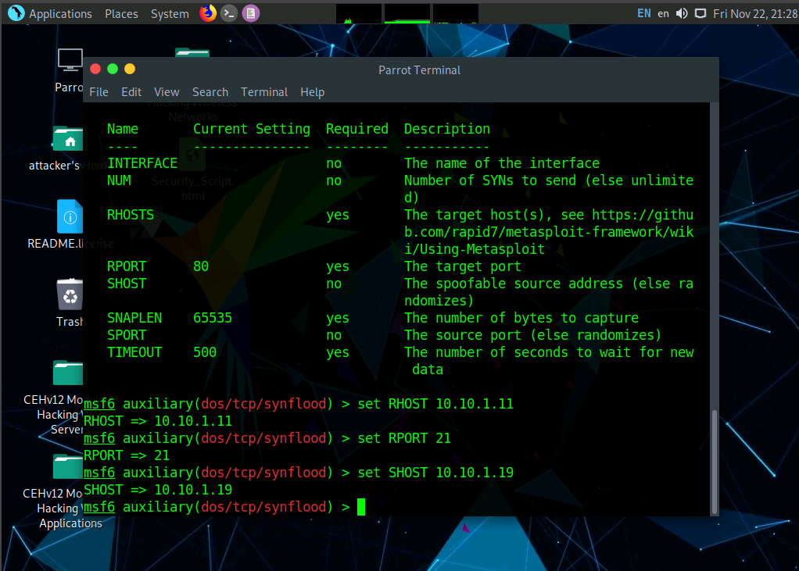
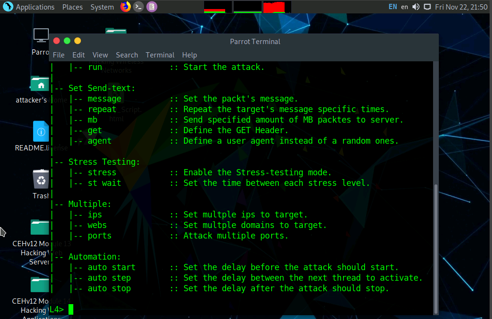
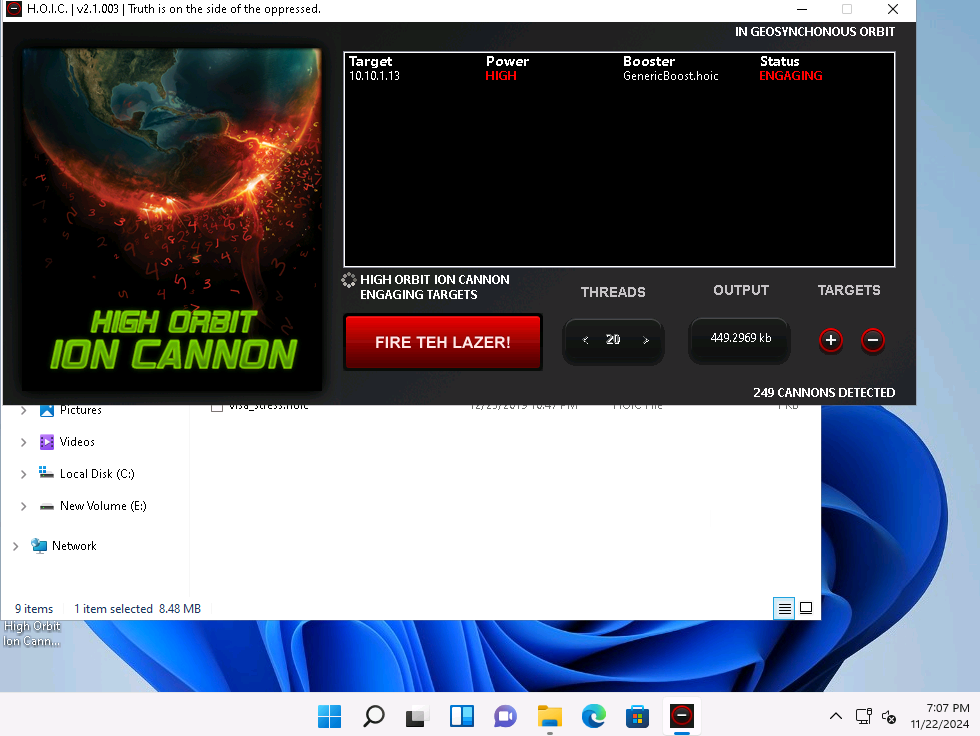
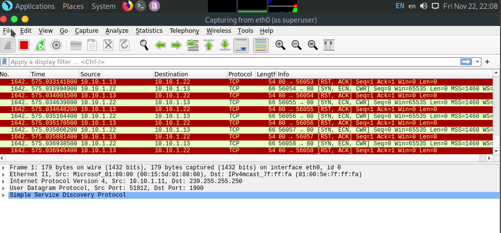
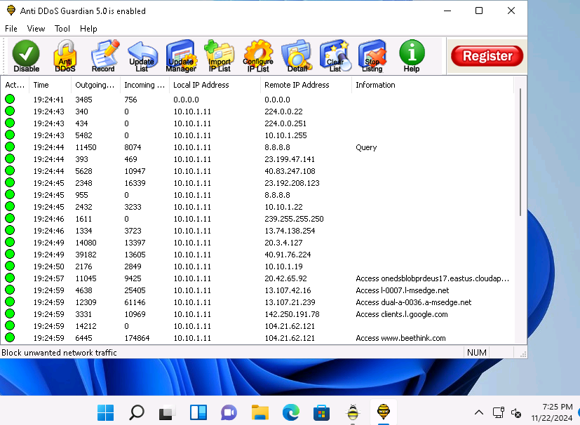

# DoS/DDoS Attacks and Defense 🔴

**Author:** CyberSal  
**Authorization:** ✅ Performed in an **EC-Council iLabs** sandbox (authorized for educational/assessment use).

---

## 🛡️ Scenario & Objectives: Attack and Mitigation

### Scenario
This project focuses on simulating both local DoS attacks and distributed DDoS attacks using multiple source points. The goal is to demonstrate the devastating effects of service unavailability and to use commercial tools to detect and mitigate these attacks in real-time.

### Objectives
* **DoS/DDoS Execution:** Execute high-volume SYN floods and Layer 7 UDP floods using specialized attack tools.
* **Attack Analysis:** Use network analysis tools (Wireshark) to identify the nature and source of the flood traffic.
* **Defense Mitigation:** Utilize commercial and open-source tools (Anti DDoS Guardian, etc.) to successfully protect the target system.
* **Defense Hardening:** Recommend security controls at the network perimeter (firewalls, IDS/IPS).

### 🧰 Key Tools Used
* **DoS/DDoS:** Metasploit (`synflood`), hping3, HOIC, LOIC.
* **Analysis:** Wireshark.
* **Mitigation:** Anti DDoS Guardian.

---

## 📊 Method & Results: DoS/DDoS Kill Chain Audit

*This section documents the structured process used to simulate, analyze, and defend against network and application layer denial of service attacks.*

### 1. Denial of Service (DoS) Attacks

We demonstrated the ability to locally saturate target resources using both the Metasploit framework and the command line tool hping3.

| Attack Type | Proof of Activity (Image) | Summary of Result |
| :--- | :--- | :--- |
| **Metasploit SYN Flood** |  | Configured the Metasploit `synflood` module to send a **continuous flood of SYN packets**, demonstrating TCP stack exhaustion. |
| **Volumetric DoS (hping3)** |  | Executed a high-rate packet flood using `hping3`, simulating a brute-force resource denial by volume. |

### 2. Distributed Denial of Service (DDoS) Attacks

We leveraged multiple client-side tools (HOIC, LOIC) to simulate a coordinated, distributed attack against the target.

| Attack Type | Proof of Activity (Image) | Analysis/Result Focus |
| :--- | :--- | :--- |
| **DDoS Tool Execution (HOIC)** |  | Launched a DDoS using HOIC from multiple sources, demonstrating the distribution and complexity of modern volumetric attacks. |
| **Traffic Analysis** |  | Analyzed the resulting traffic flood in Wireshark, identifying the **high volume and the multiple source IP addresses** characteristic of a DDoS. |

### 3. Detection and Mitigation

We demonstrated the ability to protect the target system using a commercial defense solution.

| Tool/Activity | Proof of Activity (Image) | Mitigation Outcome |
| :--- | :--- | :--- |
| **DDoS Defense** |  | Deployed and configured Anti DDoS Guardian to successfully **filter and drop malicious flood packets**, preserving target availability. |

---

## 🚀 Next Steps: Defensive Recommendations

To create a robust defense against DoS and DDoS threats, the Blue Team should focus on:
1.  **Network Architecture:** Implement **rate limiting and deep packet inspection (DPI)** at the network perimeter to drop packets that exhibit signatures of SYN floods, UDP floods, or malformed traffic.
2.  **Cloud Mitigation:** Partner with a cloud-based **DDoS scrubbing service (CDN)** to handle volumetric attacks far upstream before they can reach the local network infrastructure.
3.  **Traffic Baselines:** Establish a clear baseline of normal network traffic to enable **behavioral analysis**—allowing an Intrusion Detection System (IDS) to quickly identify and alert on sudden, massive anomalies that signal a DoS attack.
4.  **Protocol Hardening:** Ensure that all internet-facing services are behind a high-availability load balancer and are correctly configured to prevent resource exhaustion (e.g., sufficient TCP connection limits).
