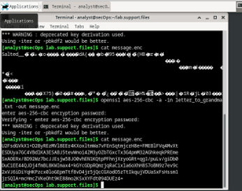

# Encryption and Cryptography Fundamentals 🟢

**Author:** CyberSal
**Authorization:** ✅ Performed in an **EC-Council iLabs** sandbox (authorized for educational/assessment use).

---

## 🛡️ Scenario & Objectives: Data Security Audit

### Scenario
This project demonstrates the core principles of cryptography by verifying data integrity (hashing), implementing symmetric encryption (AES) using OpenSSL, and exploiting a common security weakness (weak password on an encrypted file).

### Objectives
* **Integrity:** Use secure hashing algorithms (SHA-256) to verify file integrity.
* **Confidentiality:** Implement and analyze command-line symmetric encryption (AES) using OpenSSL.
* **Cryptographic Attacks:** Demonstrate the vulnerability of weak passwords on encrypted files.
* **Defense Hardening:** Recommend security policies to enforce strong encryption and password use.

### 🧰 Key Tools Used
* **Hashing/Integrity:** `sha256sum`, OpenSSL.
* **Symmetric Encryption:** OpenSSL.
* **Cryptographic Attack:** `fcrackzip`.

---

## 📊 Method & Results: Cryptography Audit

*This section documents the structured process used to apply cryptographic principles to secure data and analyze cryptographic tools.*

### 1. Data Integrity and Hashing (Lab 21.1.6)

We utilized the SHA-256 algorithm to ensure data integrity, demonstrating that even a single character change results in a completely different hash.

| Activity | Proof of Activity (Image) | Summary of Result |
| :--- | :--- | :--- |
| **File Integrity Check** |  | Used **`sha256sum`** to generate the unique hash of a file, verifying the hash against a provided signature to confirm **data integrity**. |

### 2. Symmetric Encryption and Confidentiality (Lab 21.2.10)

We implemented the Advanced Encryption Standard (AES) entirely through the **OpenSSL** command line to protect data confidentiality.

| Activity | Proof of Activity (Image) | Summary of Result |
| :--- | :--- | :--- |
| **Command-Line Encryption** |  | Encrypted a file using the **OpenSSL** command with the `-a` option, capturing the resulting **Base64-encoded ciphertext**. |
| **Command-Line Decryption** |  | Confirmed confidentiality by successfully **decrypting the ciphertext** using the matching password, recovering the original cleartext message. |

### 3. Cryptographic Attack and Defense (Lab 21.2.11)

We demonstrated a weakness in file encryption that can be exploited by an attacker using **brute-force methods** when passwords are weak.

| Activity | Proof of Activity (Image) | Summary of Result |
| :--- | :--- | :--- |
| **Password Cracking** |  | Used the **`fcrackzip`** utility to successfully perform a brute-force attack on an encrypted ZIP file, recovering the password and proving the risk of weak keys. |

---

## 🚀 Next Steps: Defensive Recommendations

To enforce a robust cryptographic security policy, the Blue Team should focus on:
1.  **Password Policy:** Enforce a strict minimum password length (**12+ characters**) and complexity policy to drastically increase the time and computing power required for cracking tools like `fcrackzip`.
2.  **Algorithm Standards:** Mandate the use of modern, secure hashing algorithms (e.g., **SHA-256**) for integrity checks and prohibit the use of deprecated or weaker standards like MD5.
3.  **Secure Key Storage:** Implement proper **Key Management System (KMS)** practices to ensure that encryption keys are never stored alongside the encrypted data and are rotated periodically.
4.  **OpenSSL Usage:** Ensure command-line encryption uses recommended settings, including a strong password and modern cipher modes, to avoid the inherent weaknesses noted in the lab.

---

## 🚀 Next Steps: Defensive Recommendations

To enforce a robust cryptographic security policy, the Blue Team should focus on:
1.  **Password Policy:** Enforce a strict minimum password length (**12+ characters**) and complexity policy to drastically increase the time and computing power required for cracking tools like `fcrackzip`.
2.  **Algorithm Standards:** Mandate the use of modern, secure hashing algorithms (e.g., **SHA-256**) for integrity checks and prohibit the use of deprecated or weaker standards like MD5.
3.  **Secure Key Storage:** Implement proper **Key Management System (KMS)** practices to ensure that encryption keys are never stored alongside the encrypted data and are rotated periodically.
4.  **OpenSSL Usage:** Ensure command-line encryption uses recommended settings, including a strong password and modern cipher modes, to avoid the inherent weaknesses noted in the lab.
