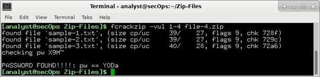

# 08 — Encryption and Cryptography Fundamentals 🟢

**Author:** CyberSal  
**Authorization:** ✅ Performed in an **EC-Council iLabs** sandbox (authorized for educational/assessment use).

---

## 🛡️ Scenario & Objectives: Data Security Audit

### Scenario
This project focuses on the foundational principles of securing data using cryptography. We analyze different encryption schemes, verify data integrity using hashing, and demonstrate a common cryptographic weakness via password recovery on encrypted files.

### Objectives
* **Integrity:** Use secure hashing algorithms (SHA-256) to verify file integrity after transfer.
* **Confidentiality:** Implement and analyze both application-level and command-line symmetric encryption (AES).
* **Cryptographic Attacks:** Demonstrate the vulnerability of weak passwords on encrypted files using a specialized cracking tool.
* **Defense Hardening:** Recommend security policies to enforce strong encryption and password use.

### 🧰 Key Tools Used
* **Hashing/Integrity:** OpenSSL, `sha256sum`.
* **Symmetric Encryption:** TNTCrypter, OpenSSL.
* **Cryptographic Attack:** `fcrackzip`.

---

## 📊 Method & Results: Cryptography Audit

*This section documents the structured process used to apply cryptographic principles to secure data and analyze cryptographic tools.*

### 1. Data Integrity and Hashing

We utilized the SHA-256 algorithm to ensure data integrity, guaranteeing that files have not been maliciously altered.

| Activity | Proof of Activity (Image) | Summary of Result |
| :--- | :--- | :--- |
| **File Integrity Check** |  | Used **`sha256sum`** to generate the unique hash of a file, verifying the hash against a provided signature to confirm **data integrity**. |

### 2. Symmetric Encryption and Confidentiality

We implemented the Advanced Encryption Standard (AES) using both a GUI tool and the command line to protect data confidentiality.

| Activity | Proof of Activity (Image) | Summary of Result |
| :--- | :--- | :--- |
| **GUI Encryption** |  | Successfully configured **TNTCrypter** with the plaintext, a secret key, and **AES-128 bit** to generate a ciphertext. |
| **GUI Decryption** |  | Confirmed data confidentiality by successfully **decrypting the ciphertext** using the matching secret key to recover the original cleartext message. |
| **Command-Line Output** |  | Encrypted a file using the **OpenSSL** command line and viewed the resulting **Base64-encoded ciphertext**, demonstrating command-line usage. |

### 3. Cryptographic Attack and Defense

We demonstrated a weakness in file encryption that can be exploited by an attacker with weak passwords.

| Activity | Proof of Activity (Image) | Summary of Result |
| :--- | :--- | :--- |
| **Password Cracking** |  | Used the **`fcrackzip`** utility to successfully perform a brute-force attack on an encrypted ZIP file, recovering the password and proving the risk of weak keys. |

---

## 🚀 Next Steps: Defensive Recommendations

To enforce a robust cryptographic security policy, the Blue Team should focus on:
1.  **Password Policy:** Enforce a strict minimum password length (**12+ characters**) and complexity policy to drastically increase the time and computing power required for dictionary or brute-force cracking tools like `fcrackzip`.
2.  **Algorithm Standards:** Mandate the use of modern, secure hashing algorithms (e.g., **SHA-256**) for integrity checks and prohibit the use of deprecated or weaker standards like MD5.
3.  **Secure Key Storage:** Implement proper **Key Management System (KMS)** practices to ensure that encryption keys are never stored alongside the encrypted data and are rotated periodically.
4.  **End-to-End Encryption:** Enforce the use of proven protocols like **TLS/SSL** for data in transit and reliable tools like **VeraCrypt** for data at rest.
