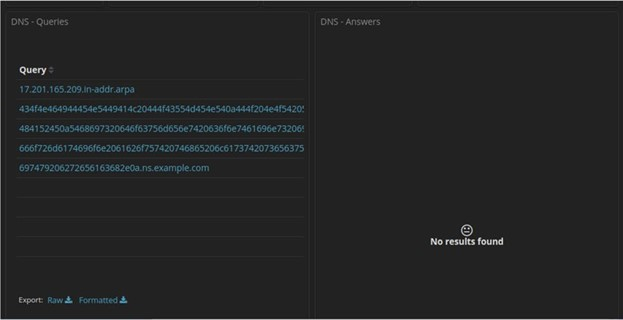
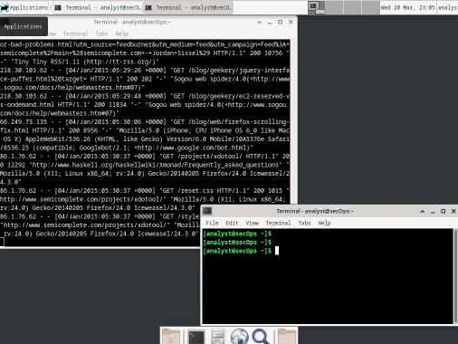
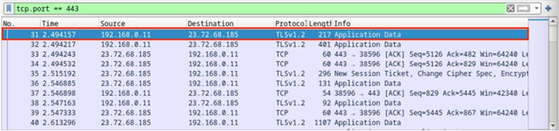
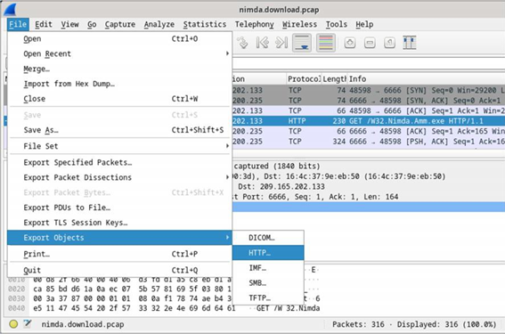

# Network Protocol Forensics and Threat Hunting 🔎

**Author:** CyberSal
**Authorization:** ✅ Performed in **Cisco Networking Academy iLabs** sandboxes (authorized for educational/assessment use).

---

## 🛡️ Scenario & Objectives: Incident Response & Data Theft Investigation

### Scenario
This project focuses on the investigative phase of incident response, analyzing network traffic captures (PCAPs) and Security Onion logs (Kibana/Zeek) to confirm data breaches, malware delivery, and web application exploitation. This demonstrates skills in turning raw logs and packets into actionable intelligence.

### Objectives
* **Investigate Web Exploits:** Analyze HTTP streams to identify successful **SQL Injection attacks** and unauthorized data access.
* **Data Exfiltration:** Investigate anomalous DNS traffic to prove that sensitive data was encoded and exfiltrated to a remote server.
* **Malware Triage:** Demonstrate the ability to extract malicious files from network traffic captures for subsequent static analysis.
* **Protocol Analysis:** Distinguish between cleartext (HTTP) and encrypted (HTTPS) traffic for forensic purposes.

### 🧰 Key Tools Used
* **Packet Analysis:** Wireshark, `tcpdump`
* **SIEM/Log Analysis:** Kibana, Zeek, `tail -f`, `awk`
* **Forensics:** `xxd` (for hex decoding)

---

## 📊 Method & Results: Incident Analysis and Evidence Gathering

*This section documents the structured process used to gather evidence from network captures and system logs .*

### 1. Web Application Exploitation (SQL Injection)

Analysis of an attack PCAP revealed a successful SQL injection attack against a web application, leading to a direct dump of critical database information.

| Activity | Proof of Activity (Image) | Summary of Result |
| :--- | :--- | :--- |
| **SQLI Verification (1=1)** |  | Analyzed the HTTP stream response confirming the database's vulnerability to the **`1=1` always-true query** . |
| **Cleartext Credentials** |  | Confirmed that unencrypted **HTTP POST requests** expose credentials and other form data in cleartext. |
| **Hash Dump** |  | Successfully analyzed subsequent queries to dump **usernames and password hashes** from the database  |

### 2. Covert Data Exfiltration (DNS Tunneling)

We used SIEM tools to filter and decode long DNS queries, confirming that the DNS protocol was being abused to steal data.

| Activity | Proof of Activity (Image) | Summary of Result |
| :--- | :--- | :--- |
| **Anomaly Detection (Kibana)** |  | Used Kibana to filter DNS traffic and observed the **small number of targeted queries** to the suspicious domain . |
| **Data Decoding Proof** |  | Captured the **unusually long hexadecimal strings** from the raw DNS queries, which contain the exfiltrated PII data . |
| **Live Log Monitoring** |  | Demonstrated real-time log analysis capability by using the **`tail -f`** command to actively monitor a log file as new entries are being written. |

### 3. Protocol Forensics and Triage

We analyzed network captures to triage malware delivery and confirm the necessity of encryption.

| Activity | Proof of Activity (Image) | Summary of Result |
| :--- | :--- | :--- |
| **Encryption Proof** |  | Verified that **HTTPS/TLS** successfully encrypts application data, making the traffic unreadable for passive sniffing. |
| **Malware Extraction** |  | Demonstrated the method to extract a malicious executable file (malware) directly from a downloaded file stream captured in a PCAP . |

---

## 🚀 Next Steps: Defensive Recommendations

To strengthen the defense of web applications and network boundaries, the Blue Team should focus on:
1.  **Input Validation/Security:** Developers must implement strict **input validation and prepared statements** (parameterized queries) at the web application layer to neutralize all forms of SQL injection.
2.  **DNS Monitoring:** Implement deep packet inspection (DPI) to monitor for **anomalously long DNS queries** (DNS Tunneling) and quickly block suspicious domains.
3.  **Mandatory Encryption:** Enforce **HTTPS/TLS** across all web assets to prevent the cleartext transmission of credentials via HTTP.
