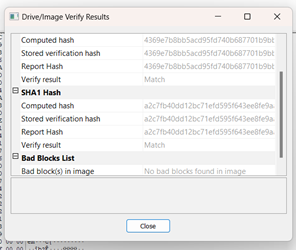
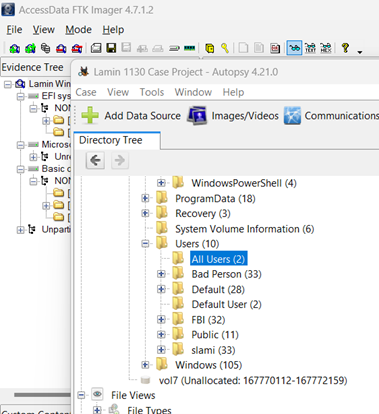
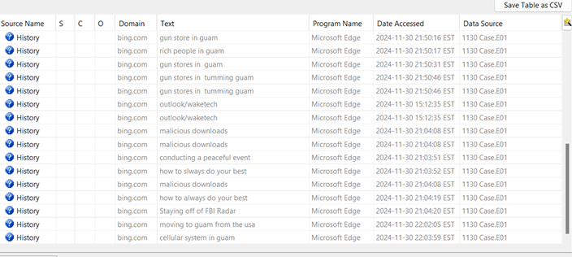
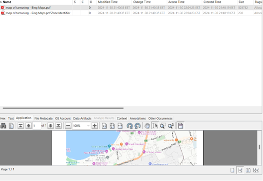
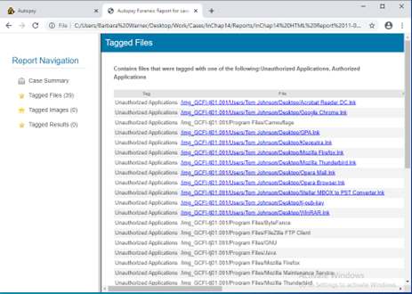
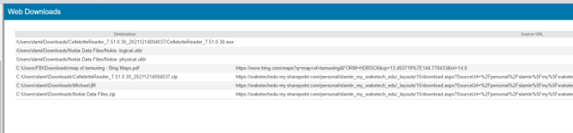

# Digital Forensics Case Study: Covert Operations Audit 🕵🏽‍♀️

**Author:** CyberSal
**Authorization:** ✅ Performed in a **CCT 240** Forensics lab environment.

---

## 🛡️ Executive Summary: Coordinated Malicious Activity

This investigation analyzed a virtual machine disk image (`E01`) to identify user activities, focusing on **S.lami**, **Bad Person**, and **FBI**. Forensic analysis confirms a concerning and coordinated overlap between **Bad Person** and **FBI** regarding **cryptocurrency theft planning** and **covert travel to Guam**. The key findings—supported by verifiable hashes and application artifacts—highlight the urgent need for intervention before their planned departure.

### Key Findings
* **Chain of Custody:** The disk image integrity was verified using MD5 and SHA1-Hashes.
* **Malicious Intent:** Overlapping searches for **"gun stores in Guam"** and **cryptocurrency theft methods**.
* **Urgency:** Both **Bad Person** and **FBI** have confirmed overlapping travel plans to the **Westin Resort Guam**.

### 🧰 Tools and Methodology
* **Forensics Imager:** **FTK Imager** (Created and verified hash of the E01 disk image).
* **Forensic Analyzer:** **Autopsy 4.2.10** (Analyzed user artifacts, web history, and device logs).

---

## 📊 Technical Analysis and Artifacts

### 1. Integrity and User Account Triage

The forensic image was verified before analysis, establishing the chain of custody. User triage confirmed three distinct profiles, two of which exhibited malicious intent.

| Activity | Proof of Activity (Image) | Analysis/Finding |
| :--- | :--- | :--- |
| **Hash Verification** |  | **Computed SHA1-Hash matches Stored Hash**, ensuring the evidence integrity and confirming the chain of custody. |
| **User Account Triage** |  | Autopsy confirmed the existence of three key user accounts: **slamin**, **Bad Person**, and **FBI**. |

### 2. Overlap Evidence and Covert Planning

The most critical evidence of coordination was found in web and device logs, demonstrating preparation for an illicit operation.

| Artifact Category | Proof of Activity (Image) | Summary of Result |
| :--- | :--- | :--- |
| **Web Search Overlap** |  | Both **Bad Person** and **FBI** searched for "gun stores in Guam" and "how to steal cryptocurrency payments." |
| **Targeted Maps** |  | **FBI** specifically saved and printed maps of **Tamuning, Guam**—the location of the suspected Westin Resort operation. |
| **Unauthorized Apps** |  | Identified and **tagged several non-corporate applications** (e.g., Kleopatra, FileZilla FTP Client) often used for covert communications or file transfer. |
| **USB Device Logs** |  | Logs confirm **multiple USB device connections** by both malicious accounts during the active planning phase. |
| **Web Downloads** |  | Downloads include maps and files like `CellebriteReader.exe` (a forensic tool) and `Nokia Data Files.zip`, confirming tool acquisition and data triage by users. |

---

## 🚨 Conclusion: Urgency and Next Steps

The technical analysis provides clear evidence of a planned, covert operation:
* The shared travel plans to Guam and the coordinated research on cryptocurrency theft and firearms point to **coordination** between Bad Person and FBI.
* **Urgency is high** due to the FBI user's scheduled multi-city flight to Brazil 7 days after the Guam trip, suggesting an attempt to exit jurisdiction.

### Next Steps:
1.  **Policy Enforcement:** Implement **Application Whitelisting** to prevent the installation of unauthorized applications found during the analysis.
2.  **Timeline Correlation:** Perform a detailed timeline analysis of all **USB device connections** to correlate file transfers with specific illegal activity.
3.  **Investigative Action:** Recommend immediate action to investigate **Bad Person** and **FBI** before their departure on December 3rd.
1.  [cite_start]**Isolate Evidence:** Preserve the data recovered from the download directory, including `Nokia Data Files.zip`[cite: 2178].
2.  [cite_start]**Timeline Correlation:** Perform detailed timeline analysis of all **USB device connections** to correlate file transfers with suspicious searches[cite: 2187, 2233].
3.  [cite_start]**Physical Intervention:** Recommend immediate physical or digital monitoring of **Bad Person** and **FBI** before their departure on December 3rd[cite: 2228].
