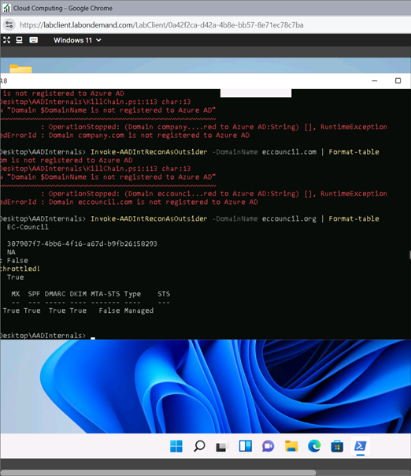
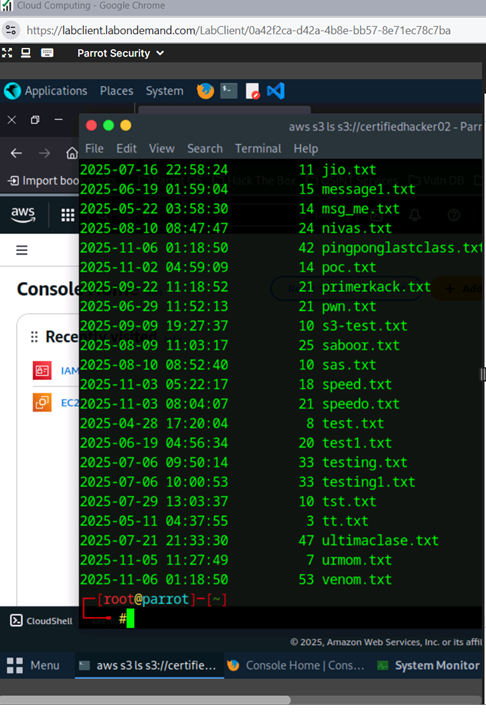
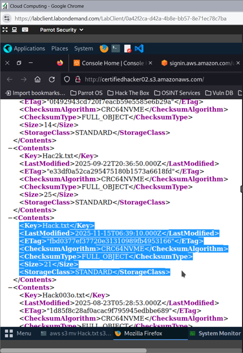
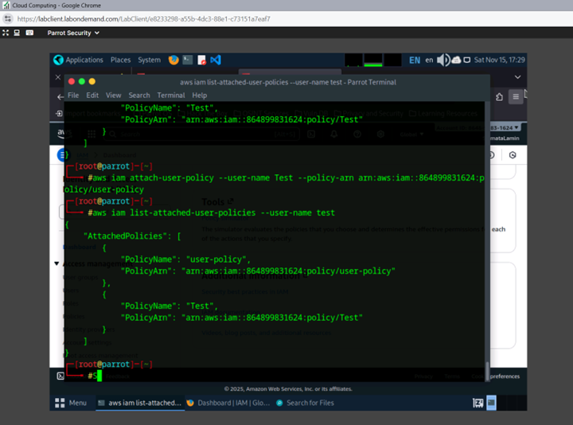
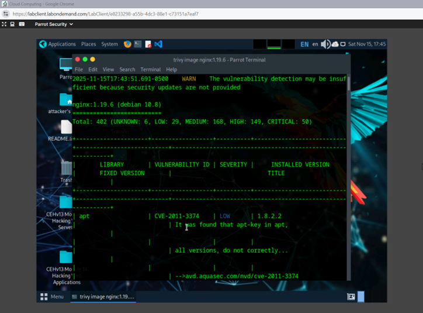

# ☁️ Cloud Security & IAM Exploitation

**Author:** CyberSal
**Authorization:** ✅ Performed in a **CEH iLabs** environment (AWS/Azure/Parrot Linux).

---

## 🛡️ Scenario & Objectives: Cloud Attack Surface Audit

### Scenario
This project simulates reconnaissance and exploitation across **Azure Active Directory (AAD)** and **Amazon Web Services (AWS)**. The goal is to identify misconfigurations that allow external reconnaissance and to exploit vulnerable Identity and Access Management (IAM) policies and S3 buckets.

### Objectives
* Perform external reconnaissance on an **Azure AD tenant** using AADInternals.
* Exploit **misconfigured AWS S3 buckets** to list, upload, and delete files using the AWS CLI.
* Escalate privileges of an IAM user by exploiting a **misconfigured user policy**.
* Conduct **vulnerability assessment** on vulnerable Docker images using Trivy.

### 🧰 Key Tools Used
* **Azure:** AADInternals (PowerShell module).
* **AWS:** AWS Command Line Interface (AWS CLI).
* **Vulnerability Scanning:** Trivy (Docker image scanner).

---

## 📊 Method & Results: Cloud Infrastructure Audit

This audit demonstrates active exploitation techniques against common cloud misconfigurations.

### 1. AWS S3 Bucket Exploitation

AWS CLI was used to exploit a publicly writable S3 bucket, demonstrating the critical impact of weak bucket policies.

| Activity | Verification Command | Finding |
| :--- | :--- | :--- |
| **Bucket Enumeration** | `aws s3 ls s3://[bucket name]` | Successfully **listed the contents** of the target bucket, confirming the public read/list permissions. |
| **File Upload/Modification** | `aws s3 cp Hack.txt s3://[bucket name]` | Confirmed ability to **upload and delete** a file, proving the misconfigured write access vulnerability. |

### 2. IAM Privilege Escalation

A vulnerability in an existing IAM policy was exploited to attach a high-privilege policy, escalating the user's access within the AWS environment.

| Activity | Verification Command | Finding |
| :--- | :--- | :--- |
| **Escalation Proof** | `aws iam list-attached-user-policies` | Verified that the high-privilege policy was successfully **attached** to the target IAM user. |

### 3. Docker Image Vulnerability Assessment (DevSecOps)

Trivy was used to scan Docker images, demonstrating the ability to perform vulnerability analysis on containerized applications.

| Activity | Verification Command | Finding |
| :--- | :--- | :--- |
| **Vulnerable Image Scan** | `trivy image nginx:1.19.6` | Successfully scanned the vulnerable `nginx` image and identified **over 400 vulnerabilities**. |
| **Baseline Scan** | `trivy image ubuntu` | Confirmed that the secure `ubuntu` baseline image reported **zero vulnerabilities**. |

### 4. Azure Active Directory Reconnaissance

Reconnaissance was performed to gather information typically exposed to external attackers about the Azure AD environment.

| Activity | Verification Command | Finding |
| :--- | :--- | :--- |
| **Domain Recon** | `Invoke-AADIntReconAsOutsider -DomainName eccouncil.org` | Successfully retrieved domain security policies (e.g., DNS, SPF, DMARC, DKIM status). |
| **User Enumeration** | `Invoke-AADIntUserEnumerationAsOutsider` | Confirmed the existence of a user within the Azure domain and retrieved login information. |

---
***

## 📸 Technical Verification Proofs

| Activity | Proof of Configuration (Image) | Description |
| :--- | :--- | :--- |
| **Azure Recon Proof** |  | Output of **AADInternals** confirming domain and user enumeration results. |
| **S3 Enumeration Proof** |  | **AWS CLI** listing files within the publicly exposed S3 bucket. |
| **S3 Upload Proof** |  | Browser output confirming the successful **upload of a file** (`Hack.txt`) to the bucket. |
| **IAM Escalation Proof** |  | AWS CLI verifying the attachment of the AdministratorAccess policy to the target IAM user. |
| **Trivy Vulnerability Scan** |  | Trivy output confirming the total vulnerability count and categorized severity for the vulnerable Docker image. |

---

## 🚀 Next Steps: Cloud Defense Recommendations

To defend against these types of cloud attacks, organizations should implement:
1.  **Principle of Least Privilege (PoLP):** Implement rigorous IAM policies. The ability to exploit a misconfigured user policy proves that overly permissive policies must be audited and reduced.
2.  **S3 Bucket Policies:** Enforce **block public access** settings by default and use **IAM roles/policies** instead of ACLs to grant conditional access to buckets.
3.  **Container Security:** Integrate vulnerability scanning tools like **Trivy** into the **CI/CD pipeline** to prevent vulnerable or outdated base images from reaching production (shifting security left).
